# Weekend MVP member and super-admin design specification

**Status:** proposed design baseline, 11 September 2026. This extends the [business strategy](2026-09-11-membership-strategy.md) and [implementation programme](2026-09-11-membership-implementation.md). It specifies the logged-in product from entry and account creation through Free, Plus and operator workflows. It is a build brief, not a claim that designs have been usability-tested or features implemented. Marketing landing pages, public acquisition-page art direction and a new hosted website builder are outside this design scope.

The direction is a warm, precise research workspace: an inviting daily desk, a scannable idea library, a trustworthy report reader and a focused weekend plan. The operator gets the same visual language at higher information density, with explicit evidence, publication and financial controls. Free and Plus share one product; the entitlement and the action available change, not the quality of the interface.

Confirmed constraints remain **one shared featured idea per day** and **under £200/month operating expenditure**. No new design SaaS subscription is required. All unconfirmed product choices below are proposed defaults to adopt in M00. Design slices D0–D6 are deliverables inside M00–M09, not a competing work-package registry.

## 1. Reference evidence and interpretation

The following authenticated screens were opened and their actual screenshots and accessibility trees inspected on 11 September. Browser captures are retained in the research conversation; private workspace screenshots are not copied into the repository. Measurements below are our proposed implementation values, not reverse-engineered measurements of competitors. No project, notification permission, content, subscription or account setting was changed in these products.

| Reference and inspected state | Observed strengths | Adopt for Weekend MVP | Deliberate adaptation |
| --- | --- | --- | --- |
| [Hilos workspace overview](https://hilos.sh/w/bc46a056-28d1-4416-83ec-a2003e686aa1) | Light workspace; editorial serif greeting; compact navigation; pastel summary tiles; divided content groups; contextual account menu | Warm surface, purposeful welcome, clear active navigation, small personal continuation block | One sidebar, not an icon rail plus a second hierarchy. A single daily report replaces four empty statistic tiles. No persistent chat composer at launch |
| [Hilos tasks](https://hilos.sh/w/bc46a056-28d1-4416-83ec-a2003e686aa1/tasks) | Search and filters grouped above task area; contextual task navigation; large illustrated permission prompt appeared | Keep controls adjacent to their results; use clear task states | Task contents were partly obscured by the notification prompt, so drag/drop and detailed task behaviour were not audited. Weekend MVP asks for optional communications contextually after value, not in a first-visit blocking modal |
| [Aura Projects](https://www.aura.build/projects) | Narrow labelled sidebar; clear page heading/action; single toolbar for search, sort and grid/list; generous whitespace; preview/name/updated metadata hierarchy | Library toolbar, consistent result units, reversible view switch, concise metadata | Text and feasibility facts carry idea selection. We do not generate a decorative screenshot for every idea or add folders before needed |
| [Aura Sites library](https://www.aura.build/projects?type=chats) | Populated multi-column library with recognizable thumbnails and per-item action menus | Saved ideas and later experiments use familiar, consistent actions | Avoid competing global marketing navigation inside the logged-in app; title/action accessible independently of thumbnail |
| [IdeaBrowser Hub](https://www.ideabrowser.com/hub) | Prominent daily report; restrained sidebar; editorial headings; facts near summary; continuation panel | Daily report first, strong report hierarchy and visible continuation | Remove competing training, event, agent and community promotions from launch home |
| [IdeaBrowser discovery](https://www.ideabrowser.com/hub/ideas/browse) and report flow, inspected during the companion audit | Facets, interest/save states, grid/table, structured research and evidence | Search → assess fit → read evidence → compare → choose an experiment | Use time, budget, support burden and buyer access rather than unexplained scores or large speculative revenue figures |

These are structural inspirations, not assets or content to reproduce. Hilos and Aura account screens are reference evidence only; their super-admin systems were not visible. Our admin design is derived from Weekend MVP's operating requirements. Competitor mobile, keyboard and payment flows were not fully tested; the accessibility requirements below describe our target, not their compliance.

### Design principles that make decisions

1. **Help the member choose and act.** On every major screen identify one dominant next action. A returning member with an experiment sees continuation before more recommendations.
2. **Show the constraints before the aspiration.** Time, running cost, ongoing support and access to buyers appear before revenue scenarios. Unknown is a valid value.
3. **Make the evidence inspectable.** Facts, estimates, assumptions and missing evidence have distinct labels and source/date treatment. Colour never substitutes for meaning.
4. **Make the free boundary understandable.** Today's report is complete while available; archived reports have useful summaries and an explicit Plus boundary. Never blur text that was delivered to the client.
5. **Keep members' work safe.** Downgrading does not erase notes or personal progress. Save state, pending edits and billing status are visible.
6. **Give operators control before speed.** Reviewing a specific revision and confirming its impact matter more than a one-click Publish button.

## 2. What exists: retain, reshape and replace

The source baseline is commit `24492003c60c208a2efd311fa0a707c104322869`. This is a source audit, not a rendered certification of the current deployment.

| Existing source | Decision and rationale |
| --- | --- |
| `components.json`; `components/ui/*` | Retain shadcn New York/neutral/RSC, CSS variables and Lucide. Twelve existing primitives: accordion, badge, button, card, dialog, form, input, label, separator, sheet, sonner, tabs. Add missing primitives selectively; do not initialize a replacement application |
| `app/globals.css`; `app/layout.tsx` | Retain Geist Sans/Mono and brand continuity. Introduce route-scoped semantic workspace tokens because root/body dark styles and `.theme-cream` coexist with hardcoded colour overrides |
| `components/platform/shell/WorkspaceShell.tsx` | Rebuild layout/navigation. Current desktop rail and sidebar consume 312px; at 768–1023px the text sidebar and mobile More menu disappear while important destinations remain outside the rail. Retain skip link and safe-area foundations |
| `components/platform/shell/DashboardHome.tsx` | Replace project/credit emphasis with daily edition and chosen experiment. Reuse sensible loading/empty-state concepts |
| `components/platform/explore/ExploreWorkspace.tsx`; `ExploreCard.tsx` | Retain URL-state/pagination foundations; implement globally correct discovery and stable item keys. Current keys include save/interest state, risking focus loss on remount. Save errors need visible feedback as well as announcements |
| `components/platform/billing/BillingWorkspace.tsx` | Rebuild around membership and renewal. Current USD project credit packs cannot be relabelled as subscriptions. Preserve legacy obligations in a separate explicit view |
| `app/signin/SignInPanel.tsx`; `app/AuthPlatformProvider.tsx` | Retain verified auth integration if staging tests pass; align visual states and return context. Replace the blank, aria-hidden black loading viewport with a useful auth-loading screen |
| `components/platform/projects/ProjectWorkspace.tsx` | Preserve existing builder for legacy owners. Reuse brief/history concepts where appropriate; do not import hosting, hostname or credit controls into My Weekend |
| Admin | No working admin app on the audited main baseline. Build the operator console as a new bounded surface using shared primitives |

Shadcn is the component foundation, not the product architecture or finished design. Use its accessible interaction primitives and own the source. Stay with the existing Radix family; current generic documentation may default to another primitive family, so select the explicit Radix examples and review generated diffs. Do not switch primitive families as incidental redesign work. [Official Radix sidebar](https://ui.shadcn.com/docs/components/radix/sidebar)

## 3. Information architecture and route contract

Retain `/dashboard` as the signed-in root to minimize migration. Labels are member language; internal domain names never appear as navigation. Public `/ideas/[slug]` URLs remain canonical acquisition routes under the separate content migration. Protected member report routes use the same stable slug and never trust a client access flag.

| Area | Proposed route | Purpose and primary action |
| --- | --- | --- |
| Today | `/dashboard` | Daily report and continuation; Read today's report / Continue my experiment |
| Explore | `/dashboard/explore` | Search qualified catalogue summaries; Open report |
| Report | `/dashboard/ideas/[slug]` | Read authorized version or useful locked summary; Plan a small test |
| Saved | `/dashboard/saved` | Personal shortlist; Compare selected / Open; `?view=notes` includes all own notes, even without a bookmark |
| Compare | `/dashboard/compare?ideas=…` | Up to three ideas; Choose this idea |
| My Weekend | `/dashboard/weekend` | One active experiment, next action and own history; Continue next task |
| Experiment | `/dashboard/weekend/[id]` | Owned checklist, observations and decision; Record result |
| Account | `/dashboard/account` | Profile, fit preferences, sign-in/security, email, data; Save changes |
| Membership | `/dashboard/billing` | Plan/access/renewal and Stripe Portal; Manage membership |
| Upgrade | `/dashboard/upgrade?returnTo=…` | Clear offer and checkout; Continue to secure checkout |
| Payment return | `/dashboard/billing/return` | Confirm server-verified access; Return to report |
| Help | `/dashboard/help` | Short product help and support request path; Contact support |
| Legacy builder | Existing `/dashboard/projects/*` and `/dashboard/new` policies | Existing customer access only as determined by inventory; not a primary member destination |
| Super-admin | `/admin/*` | Separate role-guarded shell; default `/admin/overview` |

Account sits in the sidebar footer on desktop. Mobile bottom navigation has Today, Explore, Saved, My Weekend, Account. Help and Membership are linked within Account and the desktop account menu. Only an authorized operator sees “Open admin”; its visibility is not authorization. Avoid separate Free and Plus route trees.

Query parameters preserve search, facets, sort, view and cursor. Filters and card/list views share the same result set and access rules. Validate every query and allowlist same-origin return destinations. No private note text, email, payment object or admin reason belongs in a URL.

### Member journey and recovery

```mermaid
flowchart LR
    Entry[Requested report] --> Auth[Sign in or create account]
    Auth --> Access{Server access state}
    Access -->|Today or Plus| Read[Full report]
    Access -->|Archive on Free| Preview[Public summary and Plus offer]
    Preview --> Checkout[Stripe Checkout]
    Checkout --> Pending[Confirming membership]
    Pending -->|Verified| Read
    Pending -->|Delayed| Recovery[Refresh status or get help]
    Read --> Save[Save and add personal note]
    Read --> Plan[Choose one weekend test]
    Plan --> Work[Track action and observations]
    Work --> Decision[Continue, change or stop]
    Save --> Compare[Compare up to three]
    Compare --> Plan
```

No forced preference wizard precedes the requested report. Optional fit preferences follow the first useful action. An archive deep link stays an archive preview after free registration; do not imply registration alone unlocks it. Offer a secondary route to today's free report.

## 4. Visual system: the proposed specification

### Overall composition

Use a warm off-white canvas, white reading surfaces, charcoal type and a restrained burnt-orange action colour. Hilos's warmth appears through spacing, a serif editorial accent and occasional pale panels; Aura's control grouping informs discovery; IdeaBrowser's report structure informs reading. The same shell wraps Free and Plus. Admin uses compact sans-serif headings and tables, keeping brand colour for purposeful actions.

Launch with a fully tested light workspace. Define a dark token set now for the foundation, but expose a dark/system switch only after the same screen/state matrix passes; do not make two themes a paid-beta dependency. Existing legacy dark screens remain in their old shell during transition. This decision is about a predictable first implementation, not a tier benefit.

### Semantic colour tokens

These are proposed exact starting values. Implement semantic tokens rather than scattering hex values. Validate all actual pairings, disabled/hover/focus states and contrast in D1/D6; an attractive palette alone is not an accessibility pass.

| Token / purpose | Light | Reserved dark |
| --- | --- | --- |
| `background` / application canvas | `#F8F7F4` | `#171715` |
| `foreground` / body | `#242420` | `#F2F1EB` |
| `card`, `popover` / reading and overlay surfaces | `#FFFFFF` | `#20211E` |
| `muted` / subtle section or hover | `#EFEEE8` | `#2B2C27` |
| `muted-foreground` / supporting text | `#66675F` | `#B4B5AB` |
| `border` / decorative separators | `#DDDCD3` | `#3D3F36` |
| `input` / interactive boundary | `#7B7D71` | `#929587` |
| `primary` / brand action and ring | `#B64618` | `#F39B70` |
| `primary-foreground` | `#FFFFFF` | `#28170F` |
| `secondary` / quiet button | `#EFEEE8` | `#2B2C27` |
| `secondary-foreground` | `#242420` | `#F2F1EB` |
| `accent` / selection surface | `#FBEDE4` | `#3B2A20` |
| `accent-foreground` | `#8E3614` | `#FFC9AB` |
| `success` / text or icon; soft surface | `#276043` / `#EAF3EC` | `#9CD4AF` / `#21382A` |
| `warning` / text or icon; soft surface | `#78530C` / `#FBF2D6` | `#E9CA7C` / `#3A321E` |
| `destructive` / text or icon; soft surface | `#B42318` / `#FDECE9` | `#FFADA3` / `#422522` |
| `info` / text or icon; soft surface | `#315B8A` / `#EDF2F9` | `#A9C8ED` / `#243446` |
| `sidebar` / navigation surface | `#F3F2EC` | `#1C1D19` |

Map matching foreground, sidebar selection and focus tokens explicitly. Border is for separation, not the sole input affordance; form controls use the stronger input boundary. The original `#CC5500` can remain on existing marketing; the app action colour is a deeper accessible candidate in the same family. Brand colour is never reused as a generic “failed” status.

Shadcn supports semantic CSS-variable theme pairs; use that mechanism inside a workspace theme boundary. [Official theming documentation](https://ui.shadcn.com/docs/theming)

### Type, space, shape and imagery

| Element | Specification |
| --- | --- |
| Product UI | Existing Geist Sans; 400 body, 500 controls, 600 headings. Avoid 700 everywhere |
| Editorial accent | Self-hosted [Newsreader](https://fonts.google.com/specimen/Newsreader) variable Roman, with its asset licence verified during implementation; 500 Today/report title only. Fallback Georgia. If adding the asset is deferred, ship Geist rather than an untested remote font |
| Large report title | 36/42px desktop; 28/34px mobile; maximum about 28 characters per line, natural wrap, no truncation |
| Page title / section / subheading | 28/36, 22/30, 18/26px desktop; 24/32, 20/28, 18/26 mobile |
| Reading body | 17/28px; 60–72 characters per line; 16/26px mobile |
| UI body / label / secondary | 14/21, 14/20 medium, 13/20px. Input font 16px on mobile. Critical information never smaller than 13px |
| Numbers / identifiers | Tabular numerals for money/dates/cost comparisons. Geist Mono only for job/revision IDs or code snippets, not paragraphs |
| Spacing scale | 4, 8, 12, 16, 24, 32, 48, 64px. Screen gutter 32 desktop, 24 tablet, 16 mobile. Control gap 8; section gap 32 |
| Radius | Controls 8px; cards/panels 12px; major daily panel 16px; pill only for compact labels. Map explicit local radius values rather than assuming latest shadcn scale matches installed components |
| Borders / shadows | 1px separators. No shadow for most content. Menus/dialogs use one restrained elevation. Avoid nested card borders around every report paragraph |
| Icons | Lucide, 18px navigation/actions, 16px inline metadata, consistent stroke. Text labels for major actions. No colour-only icon states |
| Images | Optional original concept image on a report, labelled “Illustrative concept”. No image required for publication or discovery. Never present a mockup as a shipped customer product. Decorative illustrations have empty alt; meaningful diagrams have explanations |
| Charts | Only sourced quantitative data. Axes, units, date range, source and accessible data table. Missing data renders “Not available”, not a zero line. No radar score chart at launch |

### Screen geometry and responsive behaviour

| Width / surface | Behaviour |
| --- | --- |
| ≥1280px | Single 232px labelled sidebar, optionally collapsed to 64px. Header 64px. Main content max 1200px, centred within available space. Report uses 200px index + minmax(0, 720px) reading column + 24px gap when space permits |
| 1024–1279px | Sidebar defaults collapsed to 64px with accessible labels/tooltips and an explicit expand button. Main gutter 24px. Report index becomes a section dropdown above the article; no three-column layout |
| 768–1023px | No persistent rail. Header Menu opens the complete 280px navigation sheet, max calc(100vw - 32px). All destinations remain available. Two result columns only if each can be at least 300px |
| 320–767px | Header 56px; five labelled bottom destinations, minimum 56px + safe area; 16px content gutter. One result column. Action dialogs become full-width sheets with visible titles/close and scrollable content |
| Member reader | Persistent header can hold back, title and Save; full title remains in article. Mobile section dropdown below header. Desktop section index sticks below header; never an overlapping second vertical sidebar |
| Admin | Sidebar 224px; tables use remaining width with max 1600px. Below 1024px use full navigation sheet and stacked detail panels. Complex table regions may scroll horizontally with labelled columns; page itself must not overflow |

Use content-driven CSS grid: two/three cards only at widths where minimum 300px fits, gap 16px. At 1440px the full member sidebar leaves approximately 1144px after gutters: three ~370px cards or report+index fit. At 1024px collapsed navigation leaves about 912px: two cards. Do not hardcode three columns based solely on viewport width.

Page scrolling is primary. Sidebar and dialog content can scroll independently; avoid nesting another scroll region around the whole report. Sticky top offsets include the status banner's actual height. Mobile compare/action trays sit above bottom navigation and reserve matching content padding; collapse trays when the software keyboard needs the space. Readability at 200% zoom and reflow at 320px are release gates.

### Motion, focus and overlays

Hover/press transitions 120ms, dropdown/dialog opacity and small translation 160ms, sidebar 180ms; no spring overshoot, parallax, auto-carousels or card lift. Respect reduced motion with immediate state changes and static skeletons. Loading does not animate every card continuously.

Use a 2px high-contrast focus outline plus 2px offset; never remove focus without a replacement. New route focuses its h1 or main region after meaningful navigation. Dialogs trap focus, Escape dismisses reversible dialogs and returns focus to the trigger. Destructive dialogs default focus to Cancel; pending irreversible submissions cannot be duplicated. Route transitions with unsaved edits use the shared discard/save guard. Menus are not nested inside another modal without a tested focus plan.

## 5. Shared component and interaction contract

Create product patterns above primitives. Shared primitives never import billing/admin domain logic. Access decisions arrive from the server; a presentation component renders the decision, never invents it.

| Pattern | Base and required behaviour |
| --- | --- |
| `MemberShell`, `AdminShell` | shadcn Sidebar/Sheet, Breadcrumb, account DropdownMenu, skip link; one landmark per nav; full destination parity at every breakpoint |
| `PageHeader` | Title, one-sentence purpose, optional breadcrumb, one primary action; actions wrap below title on mobile |
| `SearchToolbar`, `FilterSheet` | Input, Select/Combobox, chips, view ToggleGroup, result count; explicit Apply for multi-field sheets; Cancel discards pending filter edits |
| `IdeaCard`, `IdeaRow` | Same public DTO; separate title link and Save button; no nested interactive elements; stable key=idea ID; accessible pressed/selected states |
| `AccessBadge`, `LockedReport` | Distinct today/Plus/locked/withdrawn states; readable explanation and recovery action; no hidden premium DOM |
| `FitSummary`, `EvidenceLabel`, `SourceReference` | Labels and values with explanation; explicit unknown; source date plus observed/published distinction |
| `ReportRenderer` | Allowlisted typed blocks, semantic headings, validated links and source references; no executable generated MDX/HTML |
| `SaveControl`, `NoteEditor` | Optimistic Save with rollback and visible error; note autosave state, conflict recovery, owner scoping |
| `ExperimentChecklist` | Checkbox and explicit task details; keyboard reorder only if ordering is exposed; completion can be undone |
| `BillingStatus`, `CheckoutReturn` | Server-driven state machine, exact date/amount, support path; no confetti before access confirmation |
| `DataTable` | shadcn Table + selected table state utility; server pagination/filter/sort; sticky column headings only within region; labelled row menu |
| `ReviewPanel`, `RevisionDiff` | Field-level evidence issues; approved revision identity; “changed since approval” state; textual diff accessible without colour |
| `ConfirmCommand`, `JobStatus` | Action, target, impact, reason, current version and safe retry; do not translate ambiguous provider outcome to success |
| `FormField`, `EmptyState`, `InlineError`, `StatusBanner` | Consistent label/help/error spacing, focusable summary for failed forms, actionable recovery; no toast-only critical state |

Use official data-table guidance as a composition reference; server query correctness is our responsibility. [Radix data-table documentation](https://ui.shadcn.com/docs/components/radix/data-table). Existing React Hook Form wiring can remain; explicit field labels, descriptions and errors follow a consistent pattern. [Field documentation](https://ui.shadcn.com/docs/components/radix/field)

Global interaction defaults:

- Primary controls 44px high and icon targets 44×44px. Compact admin rows may use 36px controls with adequate spacing and 44px touch hit areas. No information available only on hover.
- One primary button per decision area. Secondary = outline/quiet; destructive = labelled red in its confirmation, not a red default everywhere. Pending buttons retain width and action text, e.g. “Saving…”.
- Search debounces 300ms, supports Enter, aborts/supersedes stale responses, and updates result count politely. Reset cursor on query/facet/sort change. Keep toolbar usable during loading. Never filter only the current page.
- Initial list page 24 items; admin page 25 rows; show actual range if total is known, otherwise “24 results loaded” and Previous/Next. Do not fake a total. Stable ordering includes a unique tie-breaker.
- Form validation on blur and submit, then while correcting invalid fields; no red errors before first interaction. Server validation is authoritative. Focus the first error through a linked summary.
- Toasts are for noncritical acknowledgements, generally 4–6 seconds; errors remain next to the operation. Do not put the sole undo path or a billing problem in an expiring toast.
- Reserve skeleton dimensions and use local loading regions. After 10 seconds provide a persistent useful loading explanation and retry where safe. Skeletons never imply permission before entitlement is known.
- Member notes autosave after 800ms idle and on blur, showing “Saving”, “Saved”, “Not saved — retry” or “Changes on another device”. Keep failed input in memory and offer copy; no sensitive localStorage persistence by default. Leaving with unsaved content prompts. Conflict resolution offers both versions instead of silently overwriting.
- Reauthentication recovery keeps the editor mounted and opens an explicit user-initiated separate auth window/tab where the provider supports it. After it returns, re-check server identity and restore/save the pending draft only for the same stable user ID. A broadcast or client flag cannot authorize it. If same-page navigation is unavoidable, warn before redirect and offer Copy unsaved text; do not promise persistence through OAuth navigation, tab closure or a crash. A different-account sign-in must never see or autosave the prior member's draft: lock and clear owner-specific state, with any copy opportunity offered before the account switch. Include same-user, different-user, blocked-popup and full-redirect fixtures.
- Checked state, save state and navigation collapse can be optimistic; publication, payment status, access grants and deletion completion cannot.

## 6. Free and Plus: access as an understandable UI state

Free and Plus see the same catalogue summaries, base filters, saving, personal notes and personal progress. Full reports and reusable archive research drive the upgrade. No member sees another member's notes. A saved card can be locked; the lock describes report access, not ownership of the save.

| Resource/action | Free | Plus | Required explanation |
| --- | --- | --- | --- |
| Today's report | Full approved current edition | Full | “Free today · until [local date/time] ([00:00 UTC])” on Free; date only on Plus |
| Published archive report | Public summary, public fit, included-section outline | Full | “Included with Plus” and one upgrade action |
| Save / own notes | Available | Available | Saving keeps the bookmark and your notes; report access can expire |
| Comparison | Public fields for up to 3; premium fields only for currently entitled reports | Full published report comparison | Missing/locked cells say so individually; no pooled premium text from a formerly free report |
| New guided experiment | Today's entitled template; own manual plan always allowed | Any entitled published report template | Template preview on locked idea; member can still write their own test |
| Existing personal experiment | Member-written work and accepted minimal task checklist remain | Same | Durable personal-use fields are defined below; linked licensed report sections are checked again |
| Export | Own notes/tasks/results only | Own data plus currently authorized reviewed build brief where policy permits | Separate “Export my work” from “Download research brief”; never label them interchangeably |
| Profile and account control | Complete | Complete | No paywall for cancellation, security, data rights or support |

**Plan-content boundary:** store member-authored work separately from publisher research. Checking a task records a personal progress event; it does not copy the source report into an unrestricted notes field. The proposed licence explicitly grants durable personal use and own-work export of the minimal checklist accepted while entitled: up to 5 task titles (≤140 characters each), their estimated effort, stable idea link/revision reference and the member's selected task order. Publisher evidence passages, task explanations, interview scripts, economics, report-specific hypothesis/stop criteria and the full build brief remain licensed linked content and require current report access. This small retained checklist is an explicit membership benefit, not an accidental report snapshot.

Member-entered hypothesis, budget, task edits, due dates, observations, pass/stop criteria and results are owned work and persist. Start-test fields for hypothesis/evidence/criteria are blank with generic instructional placeholders; they do not silently copy the premium template. Generic product instructions (e.g. “What result would make you stop?”) remain available to all tiers. User-authored text is not erased merely because it interprets a report. Adopt this exact field/licence mapping during D0/M03 and apply it to renderer, exports and migration.

**Rollover:** show exact local expiry with the UTC basis in a tooltip/details text; example in London summer time: “Available until 12 Sep, 01:00 BST (00:00 UTC).” Do not say local “midnight”. Use server-provided expiry; refresh access on boundary, tab refocus and reconnection. At expiry keep personal input and show “Today's free access has ended. Your notes are safe.” Subsequent protected retrieval/export is denied. Already-delivered content cannot be recalled; do not promise DRM. A withdrawn edition shows an editorial notice and no second replacement idea after that day's selection has opened.

**Paywall restraint:** no launch modal, fake countdown, full-screen upgrade takeover or persistent upgrade bar above a paying member's work. One compact sidebar/account tier prompt plus the intentional locked-report offer is sufficient. Annual billing and AI features must not appear until enabled and tested.

## 7. Member screen specifications

Every screen below inherits the global loading, error, access and responsive contracts. Screen IDs are stable references for design fixtures and acceptance tests.

### U01 — Sign in, create account and return

Centred panel max 440px, logo, heading “Your next idea starts here”, one line describing the requested destination. Google first, divider “or continue with email”, labelled email field, Continue button. Google/email create or resume a verified account through the existing provider, not a separate password form. Terms/privacy links are readable. Optional marketing opt-in is unchecked and separate; no consent hidden inside the primary button.

After email submission use an explicit “Check your inbox” screen with masked destination, change-email action, resend countdown from server, and spam/help guidance. Resend does not reveal whether an account exists. Expired/used/scanner-prefetched link has a safe recovery route and retains the requested destination. Linking an existing provider requires the verified linking flow; failure explains the next sign-in option without exposing account existence. Auth outage preserves the public fallback and disables new checkout. Return to the intended report; pending-note recovery follows the identity-safe, separate-window/copy contract in section 5 and never promises that memory survives a full-page redirect.

First member entry: optional fit prompt can be dismissed permanently and revisited in Account. No tour carousel. A single inline hint explains the daily edition. Verification needed, invalid link, provider unavailable, session expired and sign-out completion are required fixture states.

### U02 — Today: the daily desk

At 1440px use full shell; page header with local date and “A small idea. A useful next step.” Under it a main report area and optional 320px continuation column. This column only exists when the main area remains at least 600px; otherwise it stacks. The top visible region must contain the daily title, useful summary, time/cost facts and Read report action without scrolling at 1440×900.

Daily area: edition/date label, title (target≤90 characters), two-sentence summary (target≤240 characters), customer, validation effort range, upfront experiment budget and support mode. Primary “Read today's report”; Save is secondary. Place the free expiry beside access, not in a promotional strip. Evidence freshness is visible but quieter than the opportunity.

Returning members with an active experiment see a compact “Your next step” block above the daily area on mobile, and in the desktop side column. Show chosen idea, next task, estimated effort and Continue. Never show a percentage for “startup success”. Completion is “2 of 5 actions complete”. If no experiment exists, show “Choose one small test for this weekend” with a link to today's plan. Below daily content show at most 3 related public idea summaries, not an endless feed.

Free sees yesterday/related reports as summaries with a Plus badge; Plus opens them directly and never sees an upgrade CTA. First visit has no empty saved-stat tiles. Today unavailable shows reason-neutral editorial message, retry, own-work continuation and browse summaries. Plus still reads other published reports. Withdrawn/corrected states have a visible notice; no silent substitution.

### U03 — Explore

Heading “Find an idea that fits your week” with a short library description and actual qualified catalogue count when known. Toolbar: search field min 280px on desktop, Filter button with active count, sort menu, labelled grid/list toggle. Active chips appear below and have removable labels plus Clear all. A “Your fit” toggle uses explicit profile rules and explains why matches appear; no fabricated AI personalization.

Initial facets: weekly validation effort bands (≤2h, 2–5h, 5–10h,>10h), upfront test budget (≤£50,£51–£200,>£200), technical comfort, business model, audience/industry, asynchronous support suitability and evidence freshness. Hours are validation time, not time to a dependable business. Ongoing work and prototype estimates are distinct fields. Nulls appear as unknown and do not satisfy numeric thresholds. Facet chip labels include units. Start with newest editorial publication sort; offer validation effort and last evidence review. Remove “highest score” until a calibrated rubric earns it.

Card order: audience/model label; title; two-line problem summary; three consistent facts (test effort, test budget, ongoing support); evidence-reviewed date; report-access badge; title/open action and Save. Free public cards have enough information to assess fit; private research never backs their hidden tooltips. Avoid tiny screenshots as the main decision signal. Long title wraps to 3lines with full accessible title; final row aligns without truncating cost units. List view uses the same fields and stable records.

Filter sheet uses grouped labelled controls, current selected count, Clear and Apply. On desktop the panel may be a popover only if all controls fit without nested scrolling; otherwise use the same sheet. Cancel preserves committed filters. No results names the active constraints and offers Clear filters, not an upsell. A load error leaves query and filters intact. Back from a report restores list state/scroll. Search is public-summary search at launch; do not imply premium full-text search.

### U04 — Full report reader

Page header: breadcrumb/back to origin, Save, overflow for report issue/copy public link. The article contains edition/access label, full title, customer/problem summary, review date and revision/correction notice when relevant. A slim constraints strip lists validation effort, demo effort, running costs and ongoing support with definitions. One “Plan a small test” action appears near the summary and again after the practical plan, not after every section.

Section index in this order: Overview; Does it fit your week?; Evidence; Competition; Economics; This weekend's test; If the test works; Risks and stop signs; Sources. Linkable anchors update active section without stealing focus. Reading progress is optional neutral position feedback, not gamified completion. On mobile use a labelled “On this page” dropdown; no horizontal tab bar with nine tiny labels.

Evidence blocks have Claim, Evidence, Source/date, limitation. “Observed”, “Estimate” and “Assumption” labels use text and consistent subdued colour. Expand evidence detail inline; primary supporting reference remains visible. External source links open safely, with an external-link indicator. Show contradictory sources and “What we still don't know”. Do not hide weaknesses in a collapsed footer.

Economics begins with explicit assumptions, not projected revenue as a hero metric. Use a simple scenario table with price, customers, recurring costs, gross contribution and exclusions; label any editable calculator as a scenario and keep its arithmetic deterministic. No calculator is required for first launch; a sourced static table is sufficient. Unknown provider/search metrics remain unknown.

Weekend test includes objective, prerequisites, effort, cost, steps, evidence to collect, pass/stop criteria and what not to build. Separate validation, demo, paid pilot and reliable service scope. The next action creates the owned experiment after a small review panel; it never launches an AI job or hosted project silently. Sources are ordered, dated and tied to claim anchors. Report feedback asks category and optional comment; confirmation says “Thanks — this is queued for review”, never “Fixed”.

### U05 — Locked report, expired access and withdrawal

Render actual public title, summary, public fit fields, date and outline of included sections. Beneath these a bounded offer panel: “Read the full research with Plus”, factual benefits, current monthly price, renewal frequency, cancellation link, Upgrade button and “Read today's free idea”. Do not display fake blurred paragraphs, hidden full reports, made-up source counts or teaser financial outcomes drawn from private data.

Expired free access uses the same URL and layout but explains the change and leaves personal notes available in their own panel. A saved badge remains saved. A withdrawn report replaces editorial claims with correction/withdrawal information and keeps member work accessible. A truly unknown slug is 404; inaccessible draft does not disclose its existence. Unauthorized and unknown member-owned object states should not reveal another owner.

### U06 — Saved and compare

Saved has two views: Shortlist (default, newest save first) and Your notes (`?view=notes`, most recently edited first). Your notes includes every own note, including ideas no longer bookmarked and notes without an experiment. Within Shortlist, filter All / With notes / In a plan; both views search permitted titles and the member's own note text through an owner-scoped query. Avoid parallel Interested/Saved categories at launch; migrate former interested state to a clear reviewed mapping. Each row shows title, save or edit date, short own-note excerpt, access and experiment state, plus Open and labelled More. Removing a save does not delete notes or a plan; acknowledge “Removed from shortlist. Your note is in Your notes” with immediate Undo. In Your notes, show Save again for unbookmarked items and a separate confirmed Delete note command. Deleting a note never deletes a related experiment.

Checkbox selection enables a sticky tray with count, selected titles and Compare. Maximum 3; attempting 4 explains “Compare up to 3 ideas” and retains existing selection. Comparison desktop has one criteria column and 2–3 idea columns: customer, test hours, test budget, technical skill, support burden, buyer access, evidence freshness, key risk, proposed test. Public/free/locked cells are explicitly separate. Missing data says Unknown; there is no automatic winner.

Mobile comparison defaults to stacked criterion groups for all selected ideas, preserving side-by-side meaning through repeated idea names; optionally use a labelled horizontally scrollable table at tablet width. No tiny squeezed columns. Choosing an idea reviews a small experiment. Empty Saved offers today's report; empty filter offers reset. Personal note edits have autosave/conflict states. A downgrade never removes saved rows.

### U07 — My Weekend and experiment detail

One active experiment keeps scope small. Header shows selected idea, own experiment title, optional target weekend/date, and status Planned / In progress / Paused / Complete. Proposed date respects locale but is not an access entitlement. Primary button Continue next action. “Change idea” pauses the current experiment after explaining that notes/progress remain. History is an ordinary list below; no Kanban board or project management suite at launch.

Review-before-start panel contains member-entered hypothesis, maximum hours/cash, 3–5 editable minimal action tasks, intended buyer evidence, and stop criterion. Hypothesis/evidence/criterion fields start blank with generic guidance; entitled readers can consult linked research while deciding. Only the task titles/effort and revision link defined in section 6 are copied into a durable accepted checklist. Member chooses an explicit Start this test. If guided content is locked, offer today's plan or Create my own test; do not automatically copy a full premium template. Starting from a template records revision attribution while separating durable personal-use fields from licensed research.

Detail: next task with estimated effort and checkbox; list of remaining/completed actions; observation text; actual time/cash spent (optional); links to authorized research; final decision Continue / Change the test / Stop here. Every status can be corrected. Completion asks what happened and the next decision, not a testimonial. Pausing is neutral: “Your plan will be here when you return.” No streak penalties or productivity shaming.

Own notes/export remain usable on Free even when related reports lock. Export my work includes only owned fields and clearly labelled links. Start/finish/edit task actions are idempotent and owner-scoped. Concurrent-device edits are reconciled explicitly. No hosting, deployment, domain or credit-pack affordances enter this screen.

### U08 — Optional fit preferences and account

Account subnavigation: Profile & fit; Sign-in & security; Email preferences; Membership; Your data. At mobile width use a simple list of destinations, not five compressed tabs. Settings forms max 640px with explicit Save changes except switches whose persistence is clearly labelled and acknowledged.

Fit fields: weekly hours (≤2,3–5,6–10,>10), experiment budget range, technical comfort (no-code/basic/code), up to 3 industries known, preferred sales mode (async/calls/either). All optional; “Prefer not to say” or Skip is valid. Recommendations explain matched fields and offer edit; no psychometric persona required. Profile name optional, email readonly until verified change process. Do not collect employer or salary by default.

Security: connected sign-in methods, safe linking, session list with current device, revoke others, account recovery help. Linking/change email/revocation show pending, failed, successful states and fresh-auth when required. Never offer an unsupported password reset for a passwordless account. Session expiration locks pending edits and invokes section 5's separate-window reauthentication or explicit pre-redirect copy fallback. Restore/save only after the same stable user ID is verified.

Email: separate editorial newsletter/weekly digest preferences from necessary service mail. Display provider sync pending/error honestly. Newsletter unsubscribe does not cancel Plus; plan cancellation does not unsubscribe. No daily opt-in if operational capacity only supports an adopted weekly digest.

Data: Export my data starts a queued job, shows ready/expiry and reauthenticated download; deletion explains lost member work, future billing cancellation, legally retained finance data and staged completion. Require fresh auth and explicit confirmation. “Request received” is not “Deleted”. Keep request status and help accessible until completion; never create an automatic new account if the user returns with an old link.

### U09 — Upgrade, Stripe handoff and return

Upgrade is a focused page inside the shell, max 800px, two factual plan columns or stacked panels. Free explains today's single shared report; Plus lists full qualified archive and guided archive comparisons/plans. Show actual library count, price/currency, cadence, total due, cancellation behaviour and relevant tax treatment from the adopted offer. Monthly beta only; no disabled annual toggle or promised future AI.

Primary “Continue to secure checkout” creates/reuses a server-controlled checkout, then transfers to Stripe. Returning Plus users get Manage membership instead. Concurrent tabs cannot offer duplicate subscriptions. Cancelled checkout returns to the original summary, with “Checkout wasn't completed” and a safe retry using server state. Payment details live in Stripe; do not build card inputs or a homemade payment vault.

Return screen has three outcomes: Confirming membership, Plus ready, or Needs attention. Verify membership independently of query parameters. Pending: “We're confirming your payment. You don't need to pay again.” Poll boundedly, then leave a persistent status/retry/help path. Success returns to the exact requested report/anchor where valid. Payment failed gives a payment-method path; fulfilled payment with delayed access gives support/reconciliation, never another Buy button.

### U10 — Membership and service states

Membership summary: Free/Plus; active access status; current cadence/amount; next renewal or access end date; Manage membership. Display Stripe Portal as an external secure destination. Receipt/invoice list includes actual date/amount/currency/status and provider link. If tax/price changes exist, use provider truth; do not recompute financial totals from UI labels.

Cancellation scheduled: “Plus until [date]. Your membership will not renew.” Grace: “Your payment needs attention. Plus remains available until [date].” Expired: “You're on Free. Your notes and plans are still here.” Dispute/review uses neutral wording and help. No red threatening banners or countdown clocks. Portal return refetches state and shows sync status, rather than trusting the return URL.

If legacy credit/site obligations exist, show a separate labelled Legacy builder section with the original commercial units and support path. Do not combine credits and membership into one balance. Platform incident banner has last updated, affected function and useful next action. A read outage must not render a marketing upgrade card; a research generation outage must not block reading.

## 8. Super-admin: an operator console for a solo business

Admin is a separate authenticated application surface sharing tokens/primitives. It does not use the member shell or impersonate a customer. The header always shows “Weekend MVP · Admin”, environment (Production or Staging), current section, last sync and operator menu. Production uses a neutral persistent label; staging has an unmistakable blue banner. The environment label is server-provided and no decorative switch changes environment.

Navigation groups: Overview; Content (Candidates, Reports, Review, Daily schedule, Sources); Operations (Research jobs, Members, Billing, Email handoff, Data requests, Audit log, Settings). Collapse low-frequency subnavigation, keep a single-level route breadcrumb. Numeric nav badges mean unresolved actionable work, not vanity counts. There is no member-revenue leaderboard, arbitrary database browser or generic “run command” box.

Initial owner has explicit server capabilities. A later editor may draft but not refund or manage roles; a support role may view narrow account diagnostics but not source prompts/notes. Do not build staff invitation/team management before needed. Every privileged read/write is authorized regardless of route visibility. Fresh-auth requirements are visible before the final dangerous action, with the reviewed form retained. Admin session expiry locks the console and prevents stale commands.

### A01 — Overview: what needs attention

Top row contains at most 4 operational indicators: next edition readiness, approved runway in days, payment/access exceptions and monthly cost forecast. Each includes measured timestamp and clickable filtered queue; unknown/stale metrics are explicitly stale. “0 failures” is only valid if monitoring is current.

Main column is priority-ordered action queue: missing edition, paid access mismatch, failed privacy request, stuck research/review. Each item gives impact, age, owner (initially you), and one next action. Side column shows next 3scheduled editions and budget spent/reserved/forecast against monthly allocation. Small business trend strip lower down: active paid members, net collected revenue and renewals/churn with definitions/time windows. At tiny sample sizes show counts and denominators, not confident percentage trends. No charts required before real history exists.

### A02 — Candidates and research intake

Table columns: candidate title/customer, origin/source, audience fit, evidence status, duplicate status, estimated run cost, created date, next action. Default filter Needs triage. Search/facets/pagination share standard controls. Add candidate opens a form with problem/customer/source URLs and expected constraints; not a blank “generate anything” chatbot.

Candidate detail uses main brief+sources and side evaluation: already covered? customer identifiable? feasible after work? evidence accessible? allowed source use? Reject/Defer/Prepare research actions require a reason where consequential. Bulk operations limited to nonpublishing tags/triage; confirm selected count and partial failures. “Select all” initially means this page, clearly labelled.

Before Run research: show normalized brief, stages, provider configuration alias, estimated upper cost/reservation, current budget remaining and outputs expected. A hard-cap block explains which allocation is exhausted. Confirming creates a job, not a published report. Unknown cost/provider outcome blocks careless retry; no per-page render generation.

### A03 — Research jobs and job detail

Table: job ID, candidate, stage, state, attempts, elapsed, reserved/actual cost with currency, started/updated. States Queued, Running, Waiting on provider, Needs review, Failed, Cancel requested, Cancelled, Completed. “Completed” means research output exists, not approved. Filters have precise meanings; elapsed isn't a progress percentage.

Detail includes stage timeline, current attempt, validated output links, concise redacted error, source-fetch status, budget ledger and command history. Safe actions: Retry eligible stage, Stop future stages, Open draft. If provider may have completed a timed-out request, show “Outcome unknown — check provider result before retrying”. Stop explains already-accrued charges may remain. Operator can reconcile evidence of completion; no “refund tokens” fictional action. Raw prompts/provider payloads are restricted/redacted, rendered inert and never executable.

### A04 — Reports and structured editor

Report list: title, customer, lifecycle, evidence reviewed date, publication date, edition assignment, current revision, reviewer, open issues. Separate publication lifecycle (Draft / In review / Changes requested / Approved / Published / Withdrawn) from daily-feature assignment. A published archive report can be scheduled for a future free day; scheduling does not hide it from Plus.

Editor desktop layout at ≥1280: section navigator 180px, central form min 520px, evidence/issues pane 320px where space allows. At smaller widths use section selector, form and Sources/Issues tabs below. Do not squeeze three panes into a laptop. Header contains title/status/revision, autosave state and Request review. Form sections match U04, so the editor understands reader output.

Use structured fields/blocks: public summary and public fit explicitly separated from licensed report blocks. Every numerical/evidence field records value/unit, claim type, source and verification date. Inline errors link to fields. Preview is the same report renderer with an explicit role fixture selector: Public summary / Free today / Free archive / Plus. It is an admin preview endpoint, not client-side impersonation. Never change a live user's plan to test a view.

Draft autosave uses version conflicts and shows modified-by/time. Editing an approved draft invalidates approval and explains this before scheduling. Editing a published report creates a new draft revision; live content stays on its approved revision. Image control needs alt, provenance and optional concept label. No raw JSX/MDX generation field. “Request review” runs deterministic validation and shows blocking vs advisory issues separately.

### A05 — Editorial review and publication

Review page has revision header (ID/hash, author, update time), reader preview, issue list and source pane. Checklist groups: provenance/rights; factual claims and contradictory evidence; weekend feasibility; meaningful economics; originality/duplicates; public/private separation; accessibility; copy/tone. Model checks are advisory and identified as such. Human approval must reference this exact revision.

Reviewer can Request changes with field anchors and notes, Reject with reason, or Approve revision. Approval confirmation summarizes unresolved advisory issues, exact revision, and where it becomes eligible. A solo operator can be author/reviewer, but explicit review remains a separate recorded action; do not claim an independent human checked it. A revision conflict invalidates the pending approval.

Publication is separate from approval. Confirm Publish to Plus archive with title, revision, public fields preview and effective time; show status as Activating until server health checks complete. Failure leaves last known good state and recovery details. Withdraw asks scope/reason/member notice and previews effect on current edition and archive. Rollback selects an approved revision of the same idea and previews diffs; it does not clear history. No instant multi-report bulk publish at launch.

### A06 — Daily schedule and edition detail

Default agenda shows next 14 UTC dates as rows rather than a drag-only calendar. Columns: date + local equivalent, idea title, selected revision, readiness, fallback readiness, state and action. Calendar is a secondary view only if funded. An alert marks <7 approved future days. Empty date gets “Assign approved report”. Search chooser only returns eligible revisions and explains exclusions.

Schedule drawer shows UTC start/end, local equivalent, primary report, approved fallback and checks. Confirm records expected version and scheduling intent. Before activation, rescheduling/replacing is possible through explicit commands. At activation the selected idea locks. After opening, swapping to a different free idea is unavailable; only same-idea correction or withdrawal is possible. The UI states why rather than simply greying a button. Next-day assignment never leaks to member DTOs.

Edition detail shows planned primary/fallback, actual locked selection, activation/health timestamps and correction history. If no safe report is ready, show unavailable edition and operator recovery. Already-published Plus availability and free edition schedule appear as two separate statuses. Preview uses the edition's exact intended revision and clock fixture; it cannot override actual entitlement.

### A07 — Sources, claims and quality queue

Sources table: domain/title, access/rights state, observed/published dates, last checked, linked claims, stale/dead-link issues. Detail shows permitted excerpt/metadata, original URL, source-use policy and all affected reports. Stale or retracted evidence creates a review issue; it does not silently rewrite published conclusions. Bulk freshness checks reserve budget first.

Quality queue prioritizes materially unsupported claims, public/private-field leakage, duplicate reports, implausible time estimates, missing source units and rights concerns. Display severity and impact, not just a synthetic percentage. Each issue can be fixed, deferred with reason or resolved against a revision. Closing a model flag requires evidence, not another model's unqualified approval.

### A08 — Members and account diagnostics

Search exact ID/email or bounded text with rate limiting and audit. Table: member ID/display name, masked email where workable, account verification, Free/Plus access, access end, joined, unresolved request. Default view is recent support cases, not an endless PII directory. No member notes, private experiment text or provider secrets in list queries.

Detail tabs: Account, Access, Billing links, Consent, Requests, Audit. Access explanation shows decision reason and provenance (e.g. active paid period through date), last reconciliation and provider reference. Useful command is Reconcile membership, not Edit plan. A support suspension, if adopted, has scope/reason/fresh-auth and explicit effect; it must not silently stop billing. Never offer Log in as user, arbitrary owner override, direct ledger edit or downloadable all-users CSV.

If support needs a member screenshot or note, the member supplies it through a scoped support process; admin cannot browse all notes for convenience. User deletion/export follows A11. Account linking/recovery remains verified, not a manual email overwrite. Exceptional complimentary access would require a separately adopted expiring audited entitlement policy; no undocumented grant button at launch.

### A09 — Billing operations

Overview shows subscription statuses, paid-but-denied exceptions, expired-but-granted mismatches, oldest unprocessed event, duplicate subscription warnings and reconciliation freshness. State/amount/date/currency have explicit labels. Monetary totals distinguish invoiced, collected, refunded, disputed and net; MRR normalization is documented, not labelled cash.

Exception detail: masked member, Stripe customer/subscription IDs, current provider snapshot/time, local access snapshot/time, event timeline, failed operation and next safe action. “Reconcile from Stripe” is a reviewable idempotent command; success updates snapshots and logs reason. A new charge is never a repair action for a fulfillment error.

Use a securely linked Stripe Dashboard for actual refunds, dispute management and sensitive financial actions at launch. Admin records reconciliation/support references and watches resulting state. Do not build a bespoke refund form until partial refunds, tax effects, permissions and entitlement policy have a separate package. A Stripe link is labelled external and shows the expected object; no secret key in URL. Billing rows are read-only financial facts; account status overrides cannot change a ledger.

### A10 — Email handoff

List edition/campaign draft, content revision, consent audience definition, handoff state, scheduled-provider time and delivery summary if available. Preview subject, preheader, body, source/correction links and unsubscribe before approval. The same content renderer/approved facts should back email excerpts and report previews; avoid stale copied claims.

Initial operating budget may require scheduling in Beehiiv's own UI. In that case this screen says “Prepare handoff” and “Open Beehiiv”; states are Draft ready, Handed off, Provider schedule confirmed, Sent (verified), Failed. Never display a functional Send now button without a supported paid provider integration. A manual acknowledgement is labelled operator-confirmed, not provider-verified. Future in-app sends need audience/consent count, exact scheduled time, test preview and explicit final send confirmation; they are not part of the first build.

### A11 — Privacy/data requests and audit

Request queue: type Export/Delete/Consent correction, verified member reference, requested date, adopted due date, state and assigned operator. Detail gives identity verification, data categories, billing-cancellation requirements, provider tasks, retention exceptions and progress. Do not put the entire personal export in the admin browser. Secure download is member-scoped, expires and is audited.

Deletion confirmation describes exact account/owned-data effect and retained required records; fresh auth and typed target confirmation for the operator. Status transitions Requested → Verified → Processing → Completed / Needs attention. Completion requires all mandatory steps or documented lawful retention; an enqueued job is not completion. Backup suppression/tombstone reconciliation remains visible in the checklist.

Audit table: timestamp UTC, actor, action, resource reference, reason, outcome and correlation ID. Filter and paginate; redact sensitive payloads. Detail shows before/after references, not editable rows. Audit export requires capability/reason and appears in the log. Show failed commands as failed. Restricted audit is append-only through application APIs; do not claim database-level immutability.

### A12 — Settings, cost and incident controls

Settings sections: product feature flags, provider connection health, content policy versions, budget allocations, notification destinations and recovery references. Display key aliases and last success; secrets are managed in deployment/provider settings and never revealed or edited in a generic text field.

Cost panel shows actual spend, outstanding reservations and forecast separately, original currencies and planning GBP conversion basis/date. Budget lowering beneath committed spend reports the conflict. Pause optional generation at limits while auth, reads and billing processing continue. At 50/75/90% show meaningful thresholds; warnings are not provider-enforced hard caps. No slider casually changes a production cap.

Independent incident commands: pause checkout, pause content activation, pause optional research, restrict affected report delivery, disable legacy publishing. Confirmation lists customer effect, reason, operator, current state and recovery route. Use a version check so a stale tab cannot reverse a newer incident decision. Restoring service requires health evidence, not just toggling green. Display recovery/runbook links and last successful backup/restore exercise; do not promise around-the-clock operator coverage.

### Operator usability targets

A prepared daily edition should be inspectable and scheduled in≤3 minutes excluding substantive research/review. A paid-access exception should be diagnosable in≤2 minutes without raw database access. A source issue should reveal affected reports in≤2 clicks. These are test hypotheses, not promises to skip review. Mobile must support reading alerts, inspecting a case and safe pause commands. High-density editorial work is optimized for laptop; narrow screens retain a stacked form or clearly offer Save draft and continue on desktop, never a broken hidden action.

## 9. State matrix and writing specification

| Situation | Visual/interaction contract | Example copy |
| --- | --- | --- |
| Loading identity/access | Stable shell placeholder, no private report or upgrade flash | “Opening your workspace…” |
| Empty shortlist | Useful next action, no invented example records | “Nothing saved yet. Start with today's idea.” |
| No filtered results | Keep filters visible, explain reset | “No ideas match these filters. Try a wider budget or time range.” |
| Save failure | Restore prior state, inline Retry, retain focus | “This wasn't saved. Try again.” |
| Note pending/offline | Persistent unsaved status, retain in memory, Copy option | “You're offline. These changes haven't been saved.” |
| Report locked | Public summary plus bounded offer | “This report is in the Plus library.” |
| Edition unavailable | Honest temporary notice, own work still reachable | “Today's idea isn't ready yet. Your saved work is still here.” |
| Evidence incomplete | Unknown label and limitation | “We haven't found reliable search-volume data for this market.” |
| Payment pending | No purchase repetition, status/help | “We're confirming your payment. You don't need to pay again.” |
| Payment renewal failed | Exact grace/access end, provider action | “Update your payment method to keep Plus after [date].” |
| Cancellation | Exact end, own-work reassurance | “Plus ends on [date]. Your notes and progress stay.” |
| Session expired | Reauthenticate, preserve pending input safely | “Sign in again to save your changes.” |
| Admin denied | No protected details; safe navigation | “This account doesn't have access to Admin.” |
| Draft changed during review | Block stale command and load diff | “This report changed after you opened it. Review the new revision.” |
| Ambiguous job/provider outcome | Pause unsafe retry, diagnostic route | “The provider's result is not confirmed. Check it before retrying.” |
| Partial bulk failure | Success/failure counts plus per-row retry | “8 candidates updated. 2 need attention.” |
| Report corrected | Visible revision notice, sources | “Updated [date]: we corrected the running-cost estimate.” |

Voice is practical, warm and specific. Use “test”, “customer”, “hours”, “cost”, “evidence” and “next step”. Avoid “unlock your potential”, “guaranteed”, “passive income”, “validated” without a real test, developer implementation jargon and apologetic paragraphs. “Save for later” is a button; “Saved” is state; “Remove from saved” is a menu action. “Start a test” never means deploying software. No invented member wins, simulated live activity, deceptive urgency or placeholder counts presented as real.

Use sentence case throughout. GBP formatting uses Intl locale functions and explicit currency when ambiguous. Time ranges use en dashes and units. Dates show absolute values on hover/details when relative labels are used. Destructive copy names the object and consequences. Public summaries use short plain sentences; research can be detailed without sounding like a pitch deck. Content is English/GBP at launch, but components accept expanded text and do not concatenate fragments that block later localization.

## 10. Accessibility, performance and privacy acceptance

Target WCAG 2.2 AA through implementation and testing, not a logo or shadcn installation. Required coverage: text contrast, non-text affordances, keyboard order, visible focus, name/role/value, status announcements, error identification, reflow, timing and accessible authentication. This programme's 44px touch-target default is deliberately generous. A few screenshot inspections cannot certify compliance. [W3C WCAG 2.2 reference](https://www.w3.org/WAI/WCAG22/quickref/)

Test keyboard-only journeys from sign-in through report/save/compare/upgrade and admin draft/review/schedule. Screen-reader checks include VoiceOver with Safari or Chrome, form errors, selected rows, changing access, dialogs and table headers. Headings are semantic, not bold paragraphs. Decorative icons hidden from assistive tech; meaningful icons have accessible names. Loading/error announcements must not interrupt every keystroke or repeatedly read the whole page. Countdown changes are not live announcements.

Protected content must be absent from denied HTML/RSC/API/search/export responses, including preload and hidden comparison cells. UI fixtures do not replace this security proof. Names, notes, queries and admin diagnostics must not enter analytics by default. Do not enable unredacted session replay. Client persistence is restricted to nonsensitive display preferences; clear owner-specific caches on sign-out/account switch. An offline mode must not become an uncontrolled premium report cache.

Proposed performance budgets: member shell route JS≤200KB gzip before optional heavy modules, ordinary list query≤100KB at 24 summary items, member LCP≤2.5s/INP≤200ms/CLS≤0.1 at the 75th percentile when field data exists. These are targets to baseline and enforce after measurement, not results from this audit. Lazy-load admin editor/diff/table modules; do not bundle them into member entry. Fonts are self-hosted/subset and images have dimensions. Avoid an editor framework if structured inputs suffice. No LLM request on navigation, searching ordinary facets or rendering a report.

Support 360/390/768/1024/1440px layouts, 320px reflow, landscape short screens, zoom and reduced motion. Browser matrix: current Chrome/Safari/Firefox and iOS Safari/Android Chrome. Under slow network/failed provider response, members can identify what happened and retry safely. A session or entitlement transition must not discard a typed note or falsely show it saved.

## 11. Concrete design delivery and build integration

### Required design artefacts before feature-screen coding

This document fixes the direction and behaviour. It does not replace the visual validation step. D1/D2 should produce inspectable high-fidelity frames and a clickable fixture prototype **before** wiring full screens to production data. Use the existing repository's design-lab patterns if suitable, or a protected local-only component gallery; do not deploy a public admin prototype containing real records. A Figma subscription is optional, not an operating dependency.

Minimum visual frame set, using invented fixtures clearly marked as such: U01 email sent/error; U02 first-time Free and returning Plus; U03 grid/list/filter/no-results; U04 complete report and mobile reader; U05 locked/expired; U06 saved/compare; U07 active/complete plan; U08 account/data request; U09 offer/pending/ready; U10 active/cancelling/grace; A01 overview; A03 ambiguous job; A04 draft/conflict; A05 review/diff; A06 schedule/locked-day; A08 member diagnosis; A09 payment exception; A11 deletion; A12 incident/cost controls. Include desktop and mobile for each screen family, not merely resize screenshots.

Use one coherent realistic fixture report throughout the prototype, plus deliberately difficult fixtures: 140-character title, unknown budget, no metrics, long source URL, corrected report, no source image, 10,000-character note, free rollover with unsaved note, paid access delay, empty admin, failed job, revoked operator and dense 100-row result set. Fixture data must not appear as live evidence in product screenshots or launch marketing.

### Design slices mapped to the main programme

| Slice | Deliverables and ownership | Main programme gate |
| --- | --- | --- |
| D0 — Product flow and access design | Final route map, access/export boundary, screen inventory, existing-user mapping, operator capability/actions matrix | M00; behaviour contracts frozen with M02/M03 |
| D1 — Foundation | Tokens, typography/assets, shell geometry, primitive inventory, component-state gallery, tablet/navigation fixes specified | Design preparation in M00; code after M01, integrated in M02/M06 |
| D2 — Member visual prototype | U01–U10 states, responsive reader/discovery/plan, Free→Plus→cancel journey, content fixture contract | Before M06 screen implementation; M03/M04 interface freeze |
| D3 — Operator visual prototype | A01–A12 priority screens; candidate→research→review→schedule and paid-access exception journeys | Before editorial/ops UI implementation in M05/M08; M02 auth/capability contract |
| D4 — Accessible components and member integration | Domain wrappers, server-driven access, U01–U10 implementation, query/persistence contracts | M02/M03/M04/M06 owning packages, shared-file integration review |
| D5 — Operator integration and migration UX | Editorial/reconciliation/privacy screens, legacy navigation/notice, command audit/confirmation | M05/M07/M08 |
| D6 — Design verification | Visual regression matrix, accessibility/keyboard, interrupted flows, observed target-reader/operator tests | Required M09 gate and M10 rollout observation |

Design and schema evolve together during D0; expensive production code waits for the relevant contract, not every final pixel. D2/D3 visual prototypes may use fixture data in parallel after shared components settle, but a reviewer must distinguish prototypes from real auth/billing protection. Do not let one coder independently invent each page's colour, date rule or upgrade behaviour.

### Proposed file ownership during implementation

| Layer | Likely boundary; reconcile with actual tree before coding |
| --- | --- |
| Theme/primitives | Workspace-scoped stylesheet imported by member/admin layouts; `components/ui/*`; only designated foundation owner edits shared variants |
| Shell | `components/platform/shell/*`, `app/dashboard/layout.tsx`, new `app/admin/layout.tsx`; new auth/server guards stay in appropriate server modules |
| Member domain patterns | Existing explore/billing plus new `components/platform/research/*`, `saved/*`, `weekend/*`, `account/*` |
| Operator patterns | New `components/admin/*` grouped by content, jobs, members, billing, privacy, operations |
| Domain reads/commands | Existing server/Convex conventions; separate authorized DTOs and versioned command contracts, not client data filtering |
| Fixtures/verification | Redacted deterministic design fixtures and scoped visual/interaction tests; never fixtures alongside real live admin records |
| Documentation | This design baseline and adopted WP story/progress files; component inventory and screen-state acceptance updated with each owning package |

Portal content needs the correct route theme: a Sheet/Dialog mounted under `body` must receive the workspace tokens and density explicitly through a themed portal root or equivalent supported wrapper. Do not globally flip root colours to make an admin dialog look right. Test route transitions, portal overlays and hydration against existing public/legacy pages. No marketing redesign is bundled into M06.

### Integration contracts a coding agent must receive

Each screen story names its U/A ID; actor and access purpose; DTO fields and nullability; authorized query/command; states; geometry; components/tokens; exact primary/secondary copy; persistence/URL contract; mobile/keyboard behaviour; telemetry; fixture cases; and acceptance evidence. A story is not ready if a developer must invent the missing payment or privacy policy.

Member report access DTO must distinguish `loading`, `allowed_daily` (expiry/edition), `allowed_plus`, `locked_archive`, `unavailable_edition`, `withdrawn`, and true not-found without including forbidden fields. Keep owned note/progress DTO independent. Paid membership DTO contains authoritative access end, renewal state and sync status. Admin command requests include target/version, intent/reason and idempotency key; responses distinguish queued, applied, rejected-stale, denied, failed and unknown external outcome.

LLMs may help create layout variants, copy drafts and fixture tests within this contract. They must not choose access policies, fabricate source evidence, invent customer metrics, generate executable research blocks, add unmetered features or mark a screenshot as a passed money flow. Pin prompt/schema/model versions for editorial content; use deterministic rendering. Design review checks the content schema and model output against card/report constraints, not just screenshot beauty.

### Verification scenarios and acceptance measures

1. A new Free member follows a report deep link, verifies identity and reaches the correct entitled report or archive preview without a forced questionnaire.
2. Free reads today, saves it, begins a small personal checklist, types a note across UTC rollover, and sees correct access with own work preserved.
3. A Plus member locates an older report using search and filters, compares 3 ideas and starts one test. Back/forward preserves query and selection safely.
4. Upgrade returns pending while webhook is delayed; repeated refresh/multiple tabs never invite a second charge. Cancellation/grace/expiry copy matches server access.
5. A reader at 768px can reach every primary destination; at 320px reflow and 200% zoom no primary control or field error is lost.
6. Keyboard Save preserves focus and failures are visible. Dialog dismissal restores focus; screen-reader announcements identify state without exposing private content. Expired-session reauthentication covers separate-window same-user return, different-account return, blocked popup and unavoidable redirect/copy fallback; no cross-account draft display or autosave. Removing a bookmark leaves its note reachable in Your notes.
7. Operator edits approved revision A to B; approval and schedule cannot silently follow. A paid published report remains separate from its future free feature date.
8. Operator encounters unknown research outcome or payment mismatch and finds a safe recovery path without direct database editing.
9. Revoked admin/stale command/deletion failure never renders success. Production/staging identity stays visible through dialogs.
10. Existing customer can find preserved builder/credit obligations during transition; a new research member is not routed into an obsolete credit checkout.

Observe 5 target employed builders on read→assess→choose and free→paid-understanding tasks, plus at least one independent operator reviewer on publishing and billing recovery. Proposed gate: 4/5 readers can identify the day's allowance/expiry and complete the core task without assistance; no participant is led to believe saving grants permanent report access or that a forecast is validated revenue. Any billing/access misunderstanding is fixed regardless of aggregate completion. Measure time and observed confusion; small samples guide fixes, not statistical claims.

Instrument privacy-minimal events: report_opened (access class), idea_saved, comparison_started, experiment_started, first_task_completed, upgrade_viewed, checkout_started, entitlement_confirmed, billing_help_opened. Record error categories and timing, not note text or emails. Use these to improve activation and paid retention; do not optimize daily scrolling at the expense of chosen experiments.

### Time and scope impact

Allow **8–12 additional focused design/prototype working days** for D0–D3 and about **3–5 design review/verification days** across integration; many integration activities were already in M06/M08. This is an estimate, not a quote or added monthly spend. Revise the earlier 45–75 engineering-day programme to a provisional **55–90 combined design/engineering working days**, with 5–6 weeks minimum real-renewal beta observation. Sequential planning range is approximately 16–24 full-time weeks including beta, or 34–54 weeks at 15 hours/week using an 8-hour planning day; overlap is possible but must be shown, not assumed away. Research, customer interviews and adoption delays remain variable.

If capacity is tight, preserve the full design contract but stage implementation: core member/report/billing + essential editorial/recovery first; advanced source dashboards, rich charts, secondary calendar view, dark mode and batch conveniences later. Do not cut access states, account controls, safe publishing, mobile navigation or financial recovery. No chat pane, generative image programme, custom design SaaS or new hosted builder is needed to meet this design direction.

## 12. Design readiness and remaining verification

The direction, screen behaviours, component strategy, routes, responsive rules and operational workflows are specified here. The next adopted build work is the D0/D1 baseline and D2/D3 reviewable visual prototypes, with the already-required security/identity groundwork in sequence. A ground-up product experience does not require discarding the working Next/Convex foundation.

Still to verify during implementation: final rendered colour contrast/font metrics, real member and operator task performance, exact production account/provider capabilities, new admin authorization, real data density, accessible mobile dialogs, and report/export licence mapping. No competitor private admin or full mobile audit was available. No application, provider, payment or live content change was made by this design-planning task.

### Planning review

Independent product/content and security reviewers checked this addition against the business and implementation contracts. The final revision clarifies durable checklist fields, keeps unbookmarked notes reachable, adds feasible same-identity draft recovery around authentication redirects, and corrects the billing exception label to expired-but-granted. Documentation links, formatting and cross-plan scope/timing were checked. No prototype or production UX test is claimed; those remain explicit D1–D6 gates.
