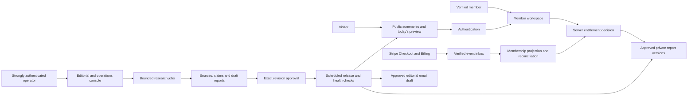

# Weekend MVP membership implementation plan

This is the implementation companion to the [membership strategy](2026-09-11-membership-strategy.md) and the [member/super-admin design specification](2026-09-11-membership-design.md). It describes proposed work, not shipped capabilities. Audit baseline: `24492003c60c208a2efd311fa0a707c104322869`, 11 September 2026. The application was not modified for this planning task. The design scope covers the complete logged-in Free/Plus product and operator console; marketing landing-page redesign is a separate future brief.

Use the Program/Migration lane after adoption. The existing program manifest and append-only rulings remain historical authorities until an explicit replacement scope is recorded. `M00`–`M12` below are provisional planning identifiers, not reserved WP numbers. Allocate actual numbers after checking the registry, including WP39/WP40 and any active branches.

## 1. Architecture and ownership

Retain one Next.js application and one Convex backend per environment. Organize by domain rather than adding services: identity, public catalogue, research, membership, member workspace, editorial, operations and legacy builder. Keep the research pipeline storage-independent, with a controlled server adapter and fixture-capable CLI using the same validators.

There are three distinct trust boundaries: the browser cannot grant access, a model cannot approve/publish, and a Stripe return URL cannot grant a membership. A central access function takes authenticated identity, resource/revision, purpose, authoritative server time and membership/edition state, then returns an allow/deny reason. Free preview, full report, export and admin access are different purposes.

### Proposed data contracts

Names below are conceptual. Preserve existing schema names until the migration mapping is reviewed. In particular, the existing `subscriptions` table is a newsletter log and must not silently become the billing table.

| Domain | Proposed records | Essential invariants |
| --- | --- | --- |
| Identity | Existing users/auth tables; profile/preferences | Stable user ID; verified identity; no caller-supplied owner authority |
| Public catalogue | Idea, public summary, facets, active revision pointer | Public DTO contains only approved public fields; stable slug |
| Research | Immutable report revisions; claims; source references; metrics | Revision schema/version/hash; claim provenance; bounded bodies/collections |
| Daily editions | UTC date, report revision, starts/ends, fallback, release state | One active edition/date; unique logical key enforced transactionally |
| Membership | Billing customer mapping, subscription snapshot, access projection | Unique customer/subscription association; no email-based ownership |
| Billing delivery | Event inbox, processing status, outbox, reconciliation cursor | Separate received/processed/failed; duplicate delivery has no duplicate effect |
| Member work | Saves, shortlist, personal notes, validation checklist | Owner-scoped; separate minimal personal tasks/progress from linked licensed report/plan content; saving never grants a report licence |
| Editorial | Candidates, review decisions, scheduled release, correction log | Only approved hash can activate; edited draft invalidates approval |
| Jobs/cost | Runs, stages, attempts, reservations, actual usage, failure queue | Bounded retries/concurrency; budget reserved before billable work |
| Operations | Admin role binding, command audit, flags, privacy requests | Server authorization, reasoned commands, minimal PII, no arbitrary ledger editor |

Indexes should support slug, active/published catalogue facets, search text, user ownership, date edition, provider event ID, subscription ID, due jobs and stale evidence. Convex indexes do not imply SQL-style uniqueness constraints; enforce logical uniqueness in transactional mutations and test concurrent replay paths with an appropriate harness.

Prefer public catalogue records distinct from private report bodies. Never query full private documents and merely remove them in a client component. Sensitive data must not leak through RSC payloads, hydration, JSON-LD, sitemaps, search facets, prefetch, image metadata, CDN caching or exports. Static articles remain trusted MDX; externally generated research uses non-executable structured blocks.

### Cache and clock contract

Public summaries may be cached and revalidated by revision. Protected report responses are private/no-store initially. They must resolve identity and current entitlement before fetching/rendering private data. Do not place user-specific data under public `use cache` keys. Read the installed Next.js documentation before selecting Cache Components APIs; this repository already has PPR soft-404 history.

An edition pointer is convenient for discovery but is not sufficient authorization. A server request checks its interval against a server clock. A background scheduler updates active public state and clients refresh at the next boundary; delayed scheduler execution cannot extend expired free access. Keep the report-read action/endpoint inaccessible through an alternate public query. Test after-midnight reads in an already-open browser as well as fresh requests.

For old routes, distinguish actual HTTP status from rendered not-found UI. Test the production build: PPR can send 200 before a not-found boundary. Do not count `noindex` as confidentiality.

## 2. Subscription state machine

Use Stripe Checkout in subscription mode with server-allowlisted price IDs, authenticated customer binding, fixed return destinations and idempotent session creation. Research membership must not require a project or a credit pack. Keep separate webhook purposes and secrets/configuration where needed for the legacy offer. Prevent multiple simultaneous subscriptions: atomically reserve one active checkout per member, reuse an unexpired session, reject new checkout for an existing supported subscription, and recover abandoned reservations through a bounded expiry/reconciliation process. Different request idempotency keys must not bypass that member-level guard. Test simultaneous tabs and interrupted session creation.

The normal loop is verified webhook -> durable event receipt -> provider-state reconciliation -> atomic membership update -> retryable notification. Record event processing separately from receipt. Out-of-order delivery must not restore an expired plan or revoke a newer paid period; reconcile canonical provider objects rather than trusting arrival order. Stripe documents subscription/invoice events and the distinction between active, incomplete, past-due and unpaid states. [Stripe subscription documentation](https://docs.stripe.com/billing/subscriptions/webhooks)

| Billing condition | Proposed access behaviour | Required interface |
| --- | --- | --- |
| No paid subscription | Daily free edition only | Current tier and clear upgrade offer |
| Checkout started/incomplete | Free until verified payment/access policy allows | Pending state; no duplicate-purchase encouragement |
| First invoice paid and supported active subscription | Grant through verified paid period | Return to requested report; receipt |
| Renewal paid | Extend exactly once | Updated renewal date |
| Renewal failure | Proposed 3-day grace from paid-through boundary, once per unpaid period | Update payment method; exact access end |
| Grace elapsed/unpaid/expired | Revert to free; keep own notes | No destructive loss of member work |
| Cancel at period end | Continue through paid-through date | Cancellation confirmation and end date |
| Immediate cancellation | Follow verified effective end | Explain access change |
| Refund | Provider financial action plus documented entitlement adjustment | Status and support trail |
| Dispute | Restrict paid access per adopted policy; preserve evidence | Neutral support state, no repeated charges |
| Duplicate/missed/old event | Idempotent processing or reconciliation | No visible entitlement flicker |

Grace, refunds and dispute resolution are proposed policies to freeze before coding; legal obligations override product defaults. Do not let repeated failed events restart grace. A paid plan's own-data deletion workflow must cancel future billing and handle retained financial records without creating a new orphaned subscription.

Implement Customer Portal for payment details, cancellation and invoices. Start with one monthly price and one annual price after the beta gate; defer complex upgrades, coupons, proration and multiple currencies until necessary. Avoid exposing an upgrade option before its invoice/proration policy is tested.

Reconcile pending events frequently and all active/recent subscriptions daily using bounded pagination and resumable jobs. Alert on paid-but-denied, expired-but-granted, duplicate subscriptions, failed finalization and unprocessed events. Stripe is financial truth; Convex holds a synchronized access projection, not an independent money authority.

## 3. Account and admin acceptance contract

Customer auth can reuse the existing foundation only after a credential-backed staging matrix passes: Google and email, expiry, logout, revoked sessions, new/returning account, verified linking, same-email collision, changed email, scanner-prefetched magic link, forwarded link and deleted account. Include email issuance throttling, verification throttling, bot abuse, generic error responses, resend delays and service-provider failure states.

The admin foundation must precede web-based editorial mutation. Bind one verified operator, require strong authentication, and use explicit capabilities for editorial approval, scheduling, account diagnostics, retry/reconciliation and emergency flags. Fresh authentication protects role changes, publication, withdrawal and irreversible privacy operations. Customer and admin sessions must not be interchangeable merely because a client flag changes.

Test anonymous/customer/admin for every privileged read and mutation. Add independent visibility checks because `convex-test` does not model internal/public access perfectly. Audit every privileged command with a reason and before/after reference; exports and minimal member lookups also need accountability. A local authorized CLI may draft research before the admin UI exists, but it must not bypass production approval/activation controls.

## 4. Work packages and gates

Each adopted package receives one branch/PR, story file, progress file, bounded file ownership and an independent review appropriate to risk. Preserve one writer for schema, proxy/middleware, package/lock files, generated API, billing handlers and migration scripts. Do not copy unmerged engine code without reviewing its actual commit and tests.

| Package | Scope and likely file boundary | Dependencies | Acceptance and stop condition |
| --- | --- | --- | --- |
| M00 — Programme adoption and inventory | `docs/wp/*`, strategy registry, redacted environment/customer/corpus inventories; D0 flow/access design and D1 foundation specification | Strategy adoption | One active manifest; old/new policy mapping; deployed commit/service map; actual commitments/costs; member/admin route and command contracts identified |
| M01 — Security and test baseline | Dependencies/lock, CI/test config, legacy event writers/routes, server builder flags | M00 | Patch applicable advisories; anonymous event writes denied; omitted suites included; worktrees excluded; all baseline checks pass |
| M02 — Identity, admin authority and data contract | Auth/schema/authz, account settings U01/U08, admin authorization/bootstrap/audit; shared shell and D1 primitives | M01 + D0 contracts | Stable user IDs; full auth matrix; admin/customer denial; strong admin auth; export/deletion design and handlers; complete navigation at tablet/mobile widths |
| M03 — Catalogue/report/edition entitlements | New membership/research contracts and read APIs, protected renderer, daily scheduler | M02 | Anonymous/free/paid matrices; no payload/cache leak; exact UTC rollover; saved is not unlocked; draft exclusion |
| M04 — Recurring billing | Membership billing modules, checkout/webhook/portal, reconciliation/outbox; U09/U10 and A09 interfaces | M02 + M03 contract freeze; D2/D3 reviewed money flows before UI integration | Stripe sandbox lifecycle matrix; replay/out-of-order/delayed payments; failed fulfillment recovery; no project dependency; pending/grace/cancellation UX |
| M05 — Evidence engine and editorial release | Pure pipeline/providers/validators, admin editorial queue, report revisions/schedule; A02–A07 | M02 + M03 contract freeze; D3 reviewed editorial prototype before UI integration | Fixture mode without credentials; cost reservations; independent sources; approved-hash release; rollback; safe unknown-outcome recovery; no generated JS |
| M06 — Member experience and discovery | Member layouts only, discovery queries, report UI, saves, comparison, My Weekend; U02–U07, shared pattern integration | M03; M04 interfaces; D1 foundation + D2 reviewed prototype | Whole-catalogue search/ranking; coherent Free/Plus journey; account/portal integration; mobile/keyboard/AA; locked/expired/empty/offline/conflict states; no marketing redesign |
| M07 — Corpus qualification and transition | Migration tooling, manifest/MDX public projections, source review, redirect compatibility | M03 + M05; prototype review | 30 qualified reports; 14-day schedule; per-slug migration mapping; no paid claim based on old audit booleans |
| M08 — Operational readiness | Privacy/retention jobs, monitoring/redaction, runbooks; A01/A08–A12 overview/member/billing/email/data/audit/settings | M04–M07; D3 operator prototype | Restore rehearsal, synthetic incident, costs/alerts, consent/unsubscribe, data request drill; operator can publish/diagnose/recover without direct data editing |
| M09 — Staging and paid beta | Gate evidence/runbooks and D6 design verification; scoped fixes via owning package | M01–M08 + D4/D5 integration | Production-build E2E, source review, billing/access reconciliation, member/operator usability and visual/accessibility state matrix; no critical/high unwaived security finding; explicit live activation |
| M10 — Controlled public launch | Feature flags, copy, staged public projections, account/customer transition | Beta exit | No access/billing incidents left unresolved; rollback ready; actual provider cost within budget; clear existing-user communication |
| M11 — Paid custom research and strategist | Owned report jobs, quota/reservation/refund, scoped retrieval | Retention/demand/cost evidence | Bounded paid usage; independent quality gate; failed-job handling; no private source leakage or unlimited promise |
| M12 — Broader IdeaBrowser functionality | Trend/niche libraries, change alerts, connectors, optional community | Separate measured case per feature | Freshness/coverage and operating load proven; scoped token access/revocation for connectors; no default hosting expansion |

Risk sequence: security first; identity and access before payments; safe content and release before a large catalogue; recovery before live activation. M04, M05 and M06 can proceed in parallel only after common contracts freeze, with integration windows for shared files. Corpus research can begin as drafts earlier; publication cannot.

### Design work is part of the programme

The [design specification, section 11](2026-09-11-membership-design.md#11-concrete-design-delivery-and-build-integration) supplies D0–D6 deliverables, screen IDs, file ownership, realistic fixtures and acceptance measures. D0 defines flows and access semantics; D1 defines tokens/shell/primitives; D2 prototypes member screens; D3 prototypes operator workflows; D4/D5 integrate them in the owning packages; D6 verifies the complete experience. These identifiers do not reserve new WP numbers.

Before each screen story is ready, it must name its U/A screen, actor, server DTO/command, null/unknown states, responsive geometry, shared components, copy, return/URL/persistence behaviour and failure fixtures. Include a reviewed visual target before production screen implementation. Fixture prototypes must be clearly labelled and cannot stand in for live entitlement or billing tests. Marketing pages retain their existing design until separately scoped; signed-in membership handoffs and legacy compatibility still belong here.

Retain the existing shadcn/Radix setup. Add workspace-scoped semantic tokens, themed portals and a single responsive sidebar; do not globally recolour marketing, reinitialize the app or mix component primitive families incidentally. No new recurring design-tool bill is assumed. Dark mode, rich charts and secondary calendar views are optional later refinements; safe access, account, editorial and payment recovery states are launch requirements.

### Core acceptance stories

These examples become executable stories, not a checklist accepted on prose alone:

1. An anonymous visitor requesting yesterday's complete report receives only its approved public summary in HTML, RSC and direct API responses.
2. A verified free member reads today's approved revision, saves it, then loses full-report access at the UTC boundary while retaining their notes.
3. A paid member cancels renewal, keeps access through the paid period and then returns to Free automatically; a stale webhook cannot restore the old period.
4. A real payment succeeds while the webhook worker is temporarily unavailable; recovery grants access once without another charge or manual database edits.
5. A free member submits another user's note ID, project ID or export ID and receives no private data.
6. An operator approves revision A, changes it to B, and cannot publish B under A's approval.
7. Unpublished report revisions remain undiscoverable until approved publication. An already-published paid report remains available to Plus before its future free-feature date; the future edition selection is not exposed publicly. A failed health check blocks edition activation; a fallback may be selected only before that day's idea is locked. Later correction or withdrawal cannot grant a second different free idea.
8. A source instructs the model to ignore rules or reveal secrets; it is treated as text and never changes tool permissions or publication authority.
9. The data provider returns no keyword metrics; the report shows unavailable evidence or fails qualification rather than inventing demand.
10. Cost reservations from simultaneous jobs cannot exceed the remaining daily/monthly allocation; a failed call is still counted if billed.
11. A query matching an older idea finds it without loading preceding pages, and pagination preserves stable globally ordered results.
12. An operator completes a deletion/export request and a restore exercise without exposing another member's data or reviving a deleted member's marketing consent.

## 5. Research implementation and evaluations

Define source, claim, metric, report-block, fit-rubric and release schemas before provider prompts. Store provider/model/prompt/schema versions, provenance and costs in every run. Use a fixture registry that needs no live credentials and includes malformed/empty/retryable provider responses.

Each durable stage has an idempotent key, input hash, attempt count, status and output reference. External calls run outside database transactions; reservations bound exposure and stage checkpoints prevent repeat work after a confirmed result. They cannot guarantee exactly-once external billing. Use provider idempotency keys where supported, persist ambiguous outcomes, and reconcile or require operator review before retrying a possibly completed call. Use one automatic retry only where demonstrably safe and within reserved cost; otherwise move to an operator queue. A timeout does not imply the provider did not charge. Never let arbitrary recursive agent tasks spawn unlimited work.

Protect URL retrieval: allowed HTTP(S) schemes, no loopback/private/link-local networks or cloud metadata endpoints, safe redirect resolution, time/byte limits, content-type validation and no browser credentials. Record restricted/unavailable sources honestly. Store permitted short excerpts and evidence facts, not a mirrored competitor database or full scraped pages by default.

A constrained report compiler maps typed blocks to UI and optional public MDX summaries. Validate links, headings, numerical provenance, prohibited claims, body size, image alt text and audience taxonomy. Keep premium blocks out of public compilation. Search indexes contain only permitted summaries; paid full-text indexing requires a separate protected query path.

The evaluation harness should report per-case pass/fail, failure reason, token/tool spend and reviewer scores. Include a held-out corpus, baseline model run and model-change review. Compare candidate extraction/drafting models at equal evidence inputs; measure accepted-report cost rather than cheapest call. Never promote a cheaper configuration merely because it produces valid JSON.

## 6. Migration plan

### Inventory before moving data

Produce a redacted inventory with counts and reconciliation totals: deployed web/backend commits, environment names, user IDs/provider relationships, newsletter consent provenance, saved ideas, projects/sites, real/synthetic leads, Stripe customers/subscriptions/payments, credit balances and pending obligations. Obtain current 90-day acquisition/usage data if accessible, but do not put PII or credentials in the manifest. List unknowns explicitly rather than assuming no customers.

For every idea slug, record current URL/body source, metadata hash, backlinks/traffic priority when available, rights/provenance state, new public summary, premium qualification state and target revision. Preserve slugs. A paid qualification failure should not erase an existing useful public URL; keep an appropriate reviewed summary or follow an explicit withdrawn-content policy.

### Expand, migrate, switch, contract

1. Add new tables/read models without removing old fields; old application stays functional.
2. Populate drafts in staging using resumable idempotent tooling. Retain user IDs and owner relationships.
3. Reconcile counts, hashes and money totals; inspect sampled low/high-risk records and all exceptional mappings.
4. Deploy dual-compatible application code with membership and report flags off.
5. Back up production database/storage and record restore points for code, configuration and provider mappings.
6. Produce a dry-run manifest of exact affected rows/routes/flags and expected results. Live execution is a separate approved gate.
7. Backfill inactive production records; verify privately before exposing discovery.
8. Enable a small member beta and staged public summaries. Monitor old/new route and entitlement behaviour.
9. Switch wider discovery only after body/assets/metadata are healthy. Preserve old records through the rollback window.
10. Remove old gates/fields/products only after migration reconciliation, customer obligations and rollback conditions close. Destructive cleanup is a later package.

There must be one active authoritative writer for each concept during transition. If temporary dual writes are needed, document their authority, idempotency and reconciliation; do not let MDX/Convex copies drift silently.

### Existing users and commercial obligations

Newsletter subscribers are invited to create/verify accounts; they are not auto-authenticated or auto-enrolled into recurring billing. Existing customer benefits are preserved or replaced through a reviewed explicit offer. Inventory existing unused credits; do not rewrite them into subscription months, confiscate them, or delete their ledger. If any hosted sites are live, parking new hosting must preserve existing service or use an agreed customer transition.

Public-content transition needs honest notice and a pilot because SEO impact is uncertain. Existing source material that was already public cannot be made confidential retrospectively. Protect the new membership delivery; do not claim it erases historical copies. Keep all complete report retrieval paths subject to the new policy, while leaving useful summaries and articles public.

## 7. Recovery and incident handling

Proposed initial recovery objectives: database/content RPO <=24 hours and a technical restoration exercise completed within four hours after an authorized operator begins recovery. Four hours is not an end-to-end 24/7 incident-response promise. At launch, document the operator's actual evening/weekend response windows and cover working-hour gaps with automatic checkout/generation shutdown and useful degraded states. Measure detection, waiting-for-operator and restoration separately; a stricter customer-facing RTO requires funded on-call cover. Payment access can be reconstructed by replay/reconciliation from Stripe; that does not replace backing up account mappings and member notes. Code rollback alone does not reverse data migrations or charges.

| Incident | Immediate action | Recovery evidence |
| --- | --- | --- |
| Paid content leaks | Disable affected protected endpoint/export; purge relevant caches; preserve evidence | Reproduce/fix denial matrix and payload scan before reopening |
| Paid users denied | Pause new checkout if widespread; preserve paid state; reconcile provider records | Paid-to-entitled counts match; no duplicate charges |
| Billing webhook failure | Persist/retry inbox; alert on age; avoid acknowledging work as complete prematurely | Failed backlog drains exactly once |
| Incorrect report | Withdraw affected revision; restore an approved revision of the same idea; never switch an opened free edition to a different idea | Correction record, public/private consistency, member communication as appropriate |
| Research cost surge | Stop optional dispatch; leave reads/auth/billing active | Cost reservations reconcile with actual provider usage |
| Auth outage | Show useful public status; disable broken new purchases | Login/recovery matrix passes; sessions not silently merged |
| Suspected admin compromise | Revoke admin sessions/role, stop privileged commands, preserve logs | Break-glass recovery by authorized identity; audit export reviewed |
| Backend data loss | Restore to isolated deployment first; reconcile Stripe and deletion/suppression tombstones | Counts/hash checks; no resurrected consent; staged traffic restore |

Keep flags independent: membership checkout, protected report delivery, content activation, research generation, legacy preview generation and legacy tenant publishing. Disable endpoints server-side, not only navigation. Do not revert to the old public full-body renderer as a billing rollback; it would leak the new paid library.

Alert on actionable changes with redacted context and a runbook link. Basic initial alerts: edition missing at 00:05 UTC, fewer than seven approved future editions, payment/access mismatch older than five minutes, research cost forecast at 75/90%, repeated auth issuance failure, failed backups and unavailable protected reads. Exact thresholds are staging-tuned defaults.

## 8. Verification programme

The audit baseline is not green: standard auth tests fail because worktree files are collected; focused suites pass; the current dependency audit fails. Fix those conditions before calling the repository release-ready. Detailed results are recorded in the accompanying evidence files.

Each implementation wave runs the configured typecheck, lint, tests and production build, plus dependency audit, taxonomy/content checks and `git diff --check`. Restore missing tests to normal collection, exclude `.worktrees/**`, and add a test inventory so reported counts refer to the intended checkout. Static string assertions cannot be the only security proof.

| Gate | Required evidence |
| --- | --- |
| Identity | Real staging Google/email journeys; negative ownership and session/linking tests |
| Entitlements | Server-level matrix; raw HTML/RSC/API/export inspection; cache and midnight boundary cases |
| Billing | Sandbox/test-clock lifecycle, replay/reorder/failure tests, portal cancellation, reconciliation |
| Content | Fixed-corpus evaluation, human review, source/rights checks, approved revision hash, publish/rollback rehearsal |
| UX / D6 | U01–U10 and A01–A12 screen-state matrix; 360/390/768/1024/1440px, 320px reflow and zoom; keyboard/focus/contrast/labels, screen-reader, slow network; observed target-reader and operator recovery journeys |
| Search | Whole-library fixtures with older matches and stable cursor ordering, query/response bounds |
| Security | Independent review, dependency patch validation, SSRF/XSS/CSRF/abuse controls, admin denial and log redaction |
| Operations | Restore exercise, synthetic failed job/webhook, deletion/export/suppression drill, cost-cap stress test |
| Production | Small authorized payment smoke/refund policy exercise, observed stranger journey and monitoring; no production test cards |

A launch blocker is any premium leak, unauthorized admin/private access, incorrect financial entitlement, unbounded AI spend, unsafe generated execution, missing recovery path or unresolved critical/high vulnerability without a documented applicability decision. Cosmetic refinements can follow; unfinished money or access flows cannot.

## 9. Timing, staffing and capacity

The expanded ground-up logged-in design brief revises the earlier 45–75 engineering/review-day estimate to **55–90 combined design/engineering working days**, including the D0–D6 design work. Allow 8–12 focused design/prototype days and 3–5 review/verification days, with overlap in previously scoped M06/M08 work rather than simply adding every estimate. Add a paid-beta observation period covering **at least one actual monthly renewal after enrolment**, with approximately **5–6 weeks** allowed for the first cohort and recovery observation. Two renewals require roughly 9–10 weeks. This is a planning range, not a delivery commitment; auth/provider migration, legacy customers, corpus rights and review quality can expand it.

At full-time equivalent capacity, allow approximately **16–24 calendar weeks** including the first-renewal beta if sequential. At 15 hours/week, 55–90 eight-hour working days equate to about 29–48 weeks of work, or roughly **34–54 weeks** with the first-renewal observation if sequential. Actual overlap must be planned against available people and dependencies. Coding agents can reduce implementation time but do not remove source review, real credentials, customer learning or elapsed renewal cycles. A smaller private beta can happen sooner by restricting catalogue size, research-brief exports and personalization; account-data access/export, billing and recovery safety remain required.

Milestones are evidence-driven: M00 inventory/adoption; M01 baseline green; M02/M03 identity/access proven; M04/M05 commerce/content complete; M06/M07 reviewed user experience and inventory; M08 operational readiness; M09 paid beta; M10 staged public launch. Do not attach a fixed launch date until M00 resolves actual customers, current provider costs and available implementation time.

The £200/month constraint is an operating constraint, not a software development budget. Estimate founder time and any legal/security specialist review separately. A minimal independent technical review should be budgeted before live billing if no qualified reviewer is available within the delivery process.

## 10. Proposed decision register for adoption

These are concrete defaults for review, not questions that block this planning deliverable. Append approved decisions to `docs/wp/RULINGS.md`; do not edit old rows.

| Decision | Proposed default | Must be fixed before |
| --- | --- | --- |
| Product | Paid research/validation membership; park new hosting | Manifest adoption |
| Product design | Adopt the linked member/admin design baseline; shadcn/Radix, warm light workspace, separate dense admin; marketing excluded | D0/D1 and screen prototypes |
| Personal work / licensed research | Preserve own notes/tasks/progress; reauthorize linked research and brief exports; no full-report copy through template creation | M03 schema + D2 prototype |
| Free allowance | Confirmed same featured idea daily; complete access for verified accounts until 00:00 UTC | M03 stories |
| Legacy content | Preserve canonical public summaries; complete app reports follow membership/daily rule; staged SEO pilot | M07 migration |
| Pricing | £15 monthly beta; £120 annual after renewal evidence | Stripe catalogue setup |
| Geography/tax/entity | Verify actual merchant entity and initial countries; GBP single-currency starting offer | Live checkout |
| Auth | Reuse if staging/strong-admin gates pass; otherwise managed integration before billing | M02 completion |
| Grace/refunds | Three-day renewal grace proposal; documented statutory/commercial refund rules | M04 tests |
| Content supply | Independent sourced reports, 30 qualified at launch, 14 scheduled editions | Beta |
| Retention | Per-data-class policy, bounded raw payloads/PII, required financial retention | M08 |
| Old credits/sites | Inventory and preserve promises; migration only through explicit policy | Any product retirement |
| AI spend | Existing $4/run ceiling plus £35 model/£20 data monthly allocations, actual cost telemetry | Live generation |
| Operator capacity | 5–8 hours/week assumption; measure and narrow scope if exceeded | Public daily commitment |

## 11. Planning verification and limitations

This package contains strategy and implementation documents plus independent source audit reports. It does not certify deployed security, legal compliance, customer demand or a successful restore. No application code, credentials, DNS, subscriptions, payments or production content were changed.

Before execution, reconcile actual production state and current dependency/provider documentation. Keep this strategy's evidence timestamp visible; model prices and platform capabilities change. Implementation evidence belongs in the adopted package stories/progress files and wave-gate report, not in retrospective claims that planned work has shipped.

### Independent review of this plan

Two independent reviewers checked product/content coherence and security/billing/infrastructure. The final revision resolves their findings: member-level duplicate-checkout prevention; distinct report-publication and edition schedules; a locked daily idea preventing double free access through fallback; no exactly-once claim for external AI billing; beta duration covering a real renewal; and recovery targets qualified by operator availability. Documentation whitespace, relative links and workflow YAML parsing were checked. Application release checks were not rerun for these documentation-only additions; the baseline audit results remain as recorded.
