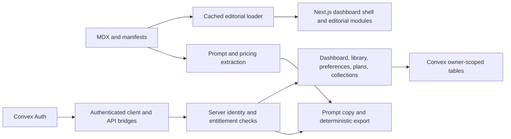
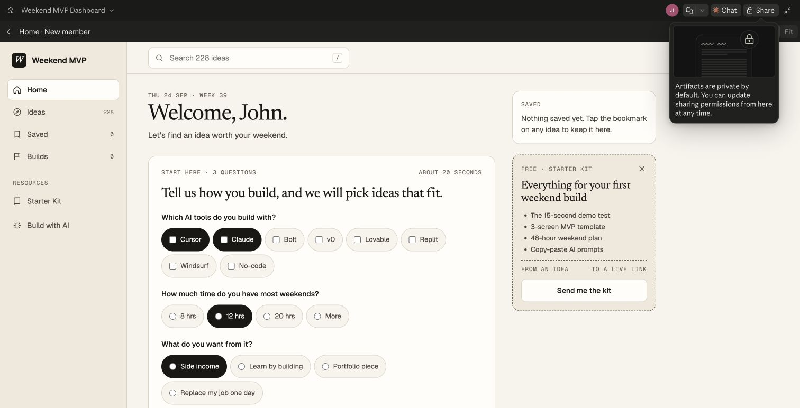
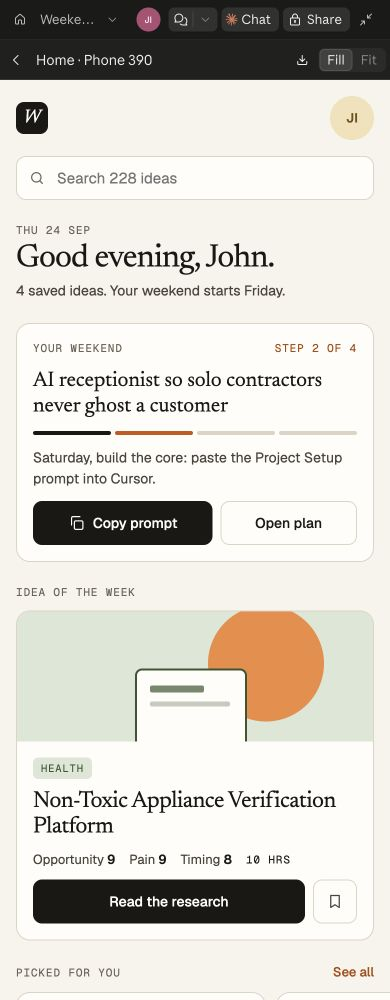
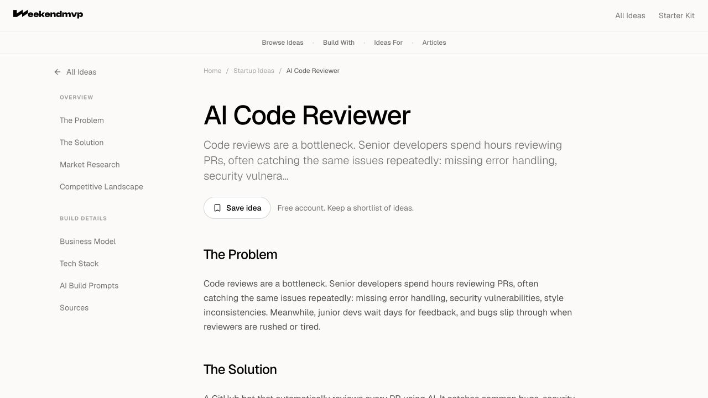
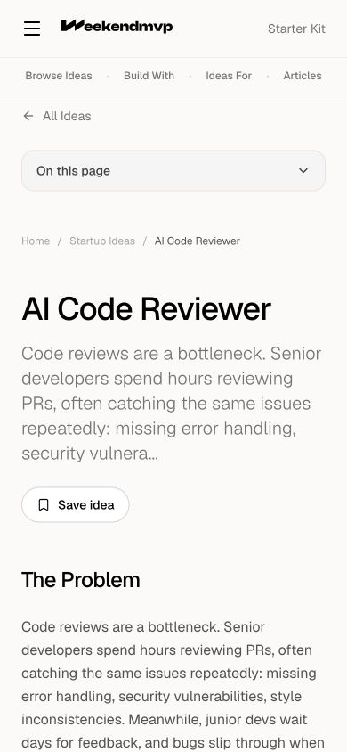

# Dashboard redesign: independent audit

Date: 26 September 2026  
Status: Review complete for the pinned source; **release not approved**. No implementation fixes made.  
Lane: Gate — verification and findings only.  
Companion: [Prioritized repair plan](2026-09-26-dashboard-fix-plan.md).

## Verdict

Keep the ideas-first product direction and the research-desk design. The separation between public research, personal workspace data and server-side entitlements is sound. A rewrite is not warranted.

Do not merge and activate this as a fully verified release yet. The standard checks pass, but independent testing reproduced pagination failures, incomplete search, stale replacement intent and an authentication-check defect. Deployment compatibility and real authenticated journeys also need evidence. Paid features should remain disabled until their separate readiness conditions are met.

No critical vulnerability or cross-account data exposure was found in the reviewed new functions. That is a bounded review result, not a security certification of the entire historical codebase.

## 1. Exact scope and evidence

| Item | Reviewed value |
|---|---|
| User-supplied session | [Dashboard redesign and PRD](https://claude.ai/code/session_01DrMvWjBYmRvZv7V67jjkJh) |
| Source branch | `claude/wizardly-rubin-a6m2th` |
| Pinned source | `7cf31deacaaa3fe7418c46b86fce0ff3602a0ef9` |
| Compared with | `origin/main` at `90859fb2f8fdd7a2459607c578d246c306278aa0` |
| Change size | 171 files; 15,291 additions; 2,166 deletions |
| Review branch | `codex/audit-dashboard-20260926` |
| Review location | `.worktrees/audit-dashboard-20260926` |
| Product authority | Branch WP44 PRD/stories and 25 September owner rulings R1–R9 |
| Visual reference | [Weekend MVP Dashboard canvas](https://claude.ai/artifact/SoKxJm9Urpeyo8p9NntLG5), inspected during this run |

The root checkout remained on `main`; its pre-existing untracked content work was left alone. The isolated review tree contains the report, plan and evidence, with no application changes. No production deployment, database migration, seed, payment, email send or credential change was performed.

The linked Claude session was still editing when opened. Its visible messages described pending fixes for pagination, drafts, prompt authentication, focus and other issues. Those messages are **claims about work in progress**, not evidence that the pinned commit contains the fixes. A later remote check still returned `7cf31dea`. Reconcile this report against the next pushed commit before assigning duplicate work.

Coverage includes the changed Next.js routes, dashboard components, public Save integration, Convex schema and new functions, authorization, entitlements, ranking, plan lifecycle, content loading, exports, analytics, tests, CI and build traces. Existing auth/middleware, public content and legacy publishing/billing were inspected at relevant integration boundaries. This was not a line-by-line audit of every historical marketing page, editorial-engine integration or legacy Stripe workflow.

Evidence classes used below:

- **Reproduced:** actual local HTTP behavior or isolated Convex behavior exercised during this audit.
- **Source-confirmed:** a concrete path is present in the pinned source; an end-to-end browser reproduction is not claimed.
- **Release gap:** required evidence is absent, without claiming the deployed product necessarily fails.
- **Recommendation:** a product or design improvement to consider, not an established defect.

## 2. Verification results

Fresh installation and checks ran in the isolated checkout using Node 22.23.1, npm 10.9.8 and installed Next.js 16.3.6. No environment files were copied and no build-time environment overrides were used.

| Check | Result |
|---|---|
| `npm ci` | Pass; 752 packages installed |
| `npm run typecheck` | Pass |
| `npm run lint` | Pass; 0 errors, 35 warnings |
| `npm test` | **1,030 tests passed**: 221 Node tests and 809 Vitest tests |
| `npm run build` | Pass; 428 pages generated; five whole-project tracing warnings |
| `npm audit --omit=dev --audit-level=high` | Pass; zero production dependency vulnerabilities |
| `npm run validate:idea-tags` | Pass; 228/228 ideas |
| Full dependency audit | Fail; one high and two moderate development-dependency entries |
| `git diff --check` | Pass |
| Independent backend defect probes | Four probes reproduced the expected defects |

The test groups were OG 91, links 6, redirects 114, auth 73, security 166, sitemap 4, Convex 348, engine 62, homepage 34 and platform 132. Runtime Convex tests provide meaningful ownership and state coverage. Test count alone does not establish browser behavior or production readiness.

Saved evidence: [machine-readable check summary](evidence/dashboard-2026-09-26/gates/summary.json), [full test log](evidence/dashboard-2026-09-26/gates/test.log), [build log](evidence/dashboard-2026-09-26/gates/build.log), [dependency audit](evidence/dashboard-2026-09-26/gates/audit-full.json), and [backend defect probe source](evidence/dashboard-2026-09-26/backend-defect-reproductions.test.ts.txt). The probe file is documentary evidence, not an installed test or a fix.

Local production-build HTTP checks also established:

- `/ideas/ai-code-reviewer` returns 200, the expected production canonical URL and two JSON-LD blocks.
- Anonymous `/dashboard` redirects to `/login?returnTo=%2Fdashboard`.
- The prompt and prompt-pack endpoints return 401 with no session cookie.
- A fabricated JWT cookie plus fabricated refresh cookie makes `/api/ideas/prompts?slug=ai-code-reviewer` return **200 with three prompts**; no valid account is involved. See A07.
- The sitemap contains 384 URLs and no `/dashboard` or `/dashboard/**` locations. This check parsed URL paths rather than matching the word “dashboard” inside public idea slugs.
- The public Save control leads to `/signup?returnTo=%2Fdashboard%2Fsaved`. Signup cannot render successfully in this isolated environment because `NEXT_PUBLIC_CONVEX_URL` is missing. The streamed response can be 200 despite this error; it is not evidence of a successful signup flow.

## 3. Prioritized findings

P1 means a release blocker or high-impact release risk. P2 means a material correctness/security/experience defect. P3 means a lower-priority improvement. Severity is separate from whether a feature is currently enabled.

| ID | Priority | Finding | Evidence | Required before |
|---|---|---|---|---|
| A01 | P1 | Real auth, backend deployment and complete dashboard interaction gate are unverified | Release gap | Free dashboard release |
| A02 | P1 | Removed Convex APIs break old clients and complicate rollback | Source-confirmed | Backend/frontend rollout |
| A03 | P1 | Sample server traces include about 471–472 MiB each | Measured release risk | Deployment |
| A04 | P2 | Ideas and Saved cannot load past 240 entries | Reproduced | Free dashboard release |
| A05 | P2 | Search filters can falsely report no results after truncation | Reproduced | Free dashboard release |
| A06 | P2 | Stale confirmation can archive a different active plan | Reproduced | Free dashboard release |
| A07 | P2 | Prompt route accepts an invented session token | Reproduced over local HTTP | Free dashboard release |
| A08 | P2 | Existing own-idea drafts have no route from Builds | Source-confirmed | Free dashboard release |
| A09 | P2 | Public Save can persist the opposite of the final click | Source-confirmed | Free dashboard release |
| A10 | P2 | A privacy guard tests a one-character slice | Source-confirmed | Closing verification gate |
| A11 | P2 | Development dependency audit has outstanding advisories | Fresh audit result | Toolchain remediation |

### A01. Passing local checks do not close the integration gate

`docs/wp/wp44-stories.md:221` leaves S13 open. `docs/wp/wp44-progress.md:427–429` explicitly records an auth bypass/fake Convex websocket and no real Convex check. Generated API declarations were hand-edited, and the schema/search-index deployment was not exercised in that environment. All eleven platform test files inspect raw source in at least some assertions; no committed browser E2E runner was found.

This audit independently confirms compilation and hermetic behavior, but has not completed real Google/magic-link login, session handoff, signup-to-Saved, reload persistence or authenticated dashboard accessibility. The isolated server has no configured Convex deployment. Prior mocked screenshots cannot close those gaps.

**Required repair:** establish a disposable staging/development backend; regenerate APIs; verify additive schema/search-index acceptance; exercise normal authentication and the critical journeys. Run keyboard, screen-reader and automated accessibility checks at 390px and 1440px, including errors, empty states and flag on/off. Do not treat the environment limitation as a production bug or as permission to bypass auth for the release test.

### A02. Backend API removal needs a compatibility window

WP44 deletes `platform.ideas.dashboardSummary`, `platform.ideas.explore` and `platform.ideas.setIntent` from `convex/platform/ideas.ts`; their removal is recorded in `docs/wp/wp44-progress.md:184`. Existing `main` clients use the old contract. An already-open old dashboard still calls those function names after the Convex deployment switches. Conversely, a new frontend needs the newly deployed functions, tables and indexes.

**Impact:** deploying backend first breaks old clients; deploying frontend first can break new clients. Rolling the frontend back alone does not restore deleted backend functions.

**Required repair:** preserve temporary old API adapters, deploy additive backend changes first, verify readiness, then deploy the new frontend. Remove old APIs in a later cleanup after a defined compatibility window. Test an old tab remaining open through deployment and a frontend rollback against the upgraded backend. No live outage was observed; this is a source-confirmed rollout hazard.

### A03. Successful compilation does not establish deployable function size

The generated NFT traces include:

| Route | Traced files | Summed bytes |
|---|---:|---:|
| `/api/ideas/prompts` | 1,748 | 494,050,166 |
| `/api/ideas/prompt-pack` | 1,772 | 494,383,594 |
| `/sitemap.xml` | 1,846 | 494,921,547 |

The prompts trace alone includes 310 public assets, accounting for 474,803,731 bytes, plus 136 documentation files. Build warnings point to dynamic filesystem operations in `lib/mdx.tsx:55` and `lib/sitemap-data.ts:35,43`. These are shared pre-existing loader patterns now reached by new routes; the issue is not wholly introduced by WP44.

These numbers are **trace-input sums, not measured final hosting-provider bundles**. No `.env` or `.git` files were found in the sampled traces. The evidence does not prove a hosting rejection or secret leak.

**Required repair:** narrow content discovery to statically identifiable roots, retain only required tracing inclusions, and inspect the actual deployment artifact. Verify cold-start and content regeneration for representative ideas before considering this risk closed.

### A04. Growing-prefix pagination stops permanently at 240

`convex/platform/libraryFilters.ts:32` and `convex/platform/dashboard.ts:24,212` cap query results at 240. `components/platform/explore/IdeasLibrary.tsx:190–200` and `SavedIdeas.tsx:185–196` continue offering “Show more” while returned count is less than total.

**Reproduction:** create 241 ideas and corresponding saves; request limits of 264 and 288. Both APIs still return 240 items and total 241. The final item is unreachable. The current manifest has 228 ideas, so this is a demonstrated near-term growth failure rather than a claimed current production outage.

**Required repair:** real pagination with truthful continuation/completion, stable ordering and reachable final records. Merely increasing the constant postpones the defect. Prove exhaustive traversal with 241+ entries and changing saves, without duplicates or missing items.

### A05. Search truncates before filters and reports false completeness

`convex/platform/ideas.ts:111–119` takes 256 results from each search index, then applies category, tools, time and goal at `:153–162`. The search branch leaves `truncated=false`. The schema declares category as a search filter field, but the query does not use it inside the search range.

**Reproduction:** 260 ideas share a title and description. Search returns total 256 and `truncated=false`. Give one excluded idea a unique category and apply that category filter: total becomes zero even though a matching idea exists.

**Required repair:** apply supported predicates inside search and provide a complete strategy for remaining filters, ordering and facets. Test a qualifying item beyond the first 256 matches, title/description deduplication, truthful totals and exhausting the result set. Do not claim “full library” when evaluating only a hidden window.

### A06. Replacement intent does not identify the plan being archived

`convex/platform/weekendPlans.ts:106–114` accepts a slug and `replaceActive` boolean. At `:142–144` it archives whatever is active at mutation time. `components/platform/builds/StartPlan.tsx:79–84` sends that boolean without the expected plan ID/version.

**Reproduction:** one tab previews replacing A with B. Another tab replaces A with C. Confirming the first tab archives C, which was not the plan named in that confirmation. This is stale user intent, not a failure of Convex transaction serialization. The data remains archived, but the UI has no restore action.

**Required repair:** send and check an expected active plan ID/version. Reject changed state with a typed conflict and a refreshed confirmation. Test two tabs, delays and retries; do not silently archive a different plan.

### A07. Token presence is not authentication on the prompts route

`app/api/ideas/prompts/route.ts:15` checks only `convexAuthNextjsToken()`. The installed adapter reads the cookie; signature/server verification is a separate operation. `middleware.ts:206` does not perform its dashboard authentication decision for this API path.

**Reproduction:** a local production-build GET with an invented JWT, future expiry and invented refresh cookie returns 200 and three real idea prompts. The same route without cookies returns 401. This was also independently reproduced by exercising the installed auth refresh code with no authentication backend calls.

**Impact:** the route’s intended member check is bypassable. The content is otherwise public research; no private owner records, paid downloads or account compromise were demonstrated. The prompt-pack route separately checks entitlements against Convex.

**Required repair:** use backend-verified authentication, or explicitly declare this endpoint public if that is the intended policy. Test missing, malformed, forged, expired, revoked and valid sessions at the HTTP boundary. The existing source-string test at `tests/platform/wp44-builds.test.ts:96–101` does not exercise invalid nonempty tokens.

### A08. Existing drafts disappear from navigation despite R4

R4 in `docs/wp/RULINGS.md:65` says existing own-idea drafts stay reachable from Builds. `components/platform/builds/BuildsList.tsx:135–148` reads and renders only weekend plans. The existing resume route remains supported in `app/dashboard/new/page.tsx:18–21`.

**Impact:** old draft data still exists, but a returning member needs a previously saved URL to resume it.

**Required repair:** a small existing-drafts section on Builds with owner-scoped resume links. Preserve the pause on new own-idea creation and site publishing. Reconcile S7’s blanket “no project links” language with R4’s explicit exception rather than overriding the owner ruling.

### A09. Public Save requests can commit out of order

`components/ideas/SaveIdeaButton.tsx:82–103` sends a POST for each click and changes local state optimistically. At `:112` the button is disabled only during initial loading. Successful responses do not reconcile saved state.

**Trigger:** rapidly click Save then Unsave while requests overlap. If the requests reach the backend in reverse order, the database ends saved while the UI says unsaved. An older failed request can also revert a newer successful intent. This is source-confirmed asynchronous behavior, not a browser race reproduced in this run.

**Required repair:** serialize writes or use a last-intent request strategy, ignore superseded failures and reconcile the authoritative response. Test controlled request ordering and success/failure interleavings. Preserve responsive feedback and accessible announcements.

### A10. A privacy assertion is vacuous

`tests/platform/wp44-offers.test.ts:37` searches the sliced query handler for `const offerValidator`, which occurs earlier in the source at `convex/platform/dashboard.ts:238`. The index is -1, so the assertion checks the final character of the handler.

**Impact:** the static guard cannot detect the sensitive field it claims to exclude. This is not evidence of actual email leakage: separate Convex runtime tests and the response validator check the returned offer shape.

**Required repair:** assert actual response properties and prove the guard fails when a sensitive field is deliberately introduced. Keep structural tests for appropriate boundaries, but do not substitute source strings for interaction tests.

### A11. Development dependencies still need remediation

The full dependency audit reports nested ESLint `js-yaml` as high severity and Vitest/`@vitest/mocker` as moderate entries. The production-only audit is clean.

**Required repair:** a scoped development-tool dependency update, advisory applicability review and rerun of the configured checks. Do not present these findings as demonstrated production exploits. Keep this work separate from behavioral fixes so failures remain attributable.

## 4. Paid-feature and policy blockers

These are not reasons to start subscription implementation during this review. They define what must remain gated.

| ID | Finding | Evidence and required resolution |
|---|---|---|
| B01 — P2 | “Unlimited” active plans and history are not complete | `weekendPlans.ts:43–50` reads only 20 active records and reuses that window for duplicate detection and replacement. A reproduced 21-plan fixture hides one plan; restarting it creates a duplicate; downgrade replacement leaves multiple active plans. Finished history also stops at 20, and usage counts at 50. Separate display pagination from exact invariant queries and define downgrade behavior before enabling paid accounts. `planResolver.ts:13` currently returns Free for everyone. |
| B02 — P2 | Collection deletion lacks recovery and cancellation focus | `components/platform/hub/CollectionView.tsx:172–180` has no catch/pending state for deletion, and cancellation unmounts the focused control without restoration. Handle rejection, prevent duplicate submission and return focus to a connected trigger/heading. Validate in a real browser. |
| B03 — P3 | Upgrade close can target a detached element | Rename-to-upgrade at `CollectionView.tsx:159–161` unmounts the original trigger. `UpgradeSheet.tsx:80–83` can prevent default focus return and focus that stale element. Use a connected target or fallback. |
| B04 — decision needed | Physical deletion conflicts with the earlier v1 lifecycle ruling | The 5 August WP22 ruling permits archive/soft-delete and defers physical deletion. New `collections.ts:123–124` and `notes.ts:58–59` physically delete records; S11 says “delete” but no explicit lifecycle supersession was found. Clarify whether the new record types are exempt, or use soft deletion. Do not silently reinterpret an irreversible-data policy. |
| B05 — activation condition | Upgrade UI is not a working subscription product | The feature flag is build-time UI control; the resolver is always Free and `UPGRADE_HREF` leads to a “Not open yet” billing section. This is an intentional scaffold, not completed checkout. Keep the flag off until subscription lifecycle, cancellation/downgrade, payment verification and associated UX pass their own gate. |

The existing publish and credit APIs also remain callable by their authenticated owners. R5 explicitly preserves old routes and code unlinked, so this is not automatically a WP44 authorization defect. “Parked” currently means removed entry points, not a server kill switch. Check activation configuration before any future publishing launch; this audit did not inspect production activation state.

## 5. Architecture and database assessment

### Preserve these choices

- Public idea pages remain the canonical research source. Dashboard personalization does not create a second research corpus or a research paywall.
- The five new tables (`user_preferences`, `weekend_plans`, `collections`, `collection_items`, `idea_notes`) and two search indexes are additive. Existing schema fields are not narrowed.
- Ownership comes from the authenticated session. Missing and foreign plan/collection IDs receive the same denial. No new cross-owner read/write path was found in the inspected functions.
- Paid actions enforce entitlements on the backend, not merely through hidden buttons. Owners retain read/removal access to their records after downgrade.
- Collection items are separate rows; item counts update in the same transaction. Preferences, notes and plan mutations use owner-scoped indexes.
- Ranking is deterministic and explainable. Reasons map to actual preferences or saved categories rather than fabricated personal claims.
- Notes render as text; live URLs restrict schemes and reject credentials; personalized Save/export responses use private/no-store behavior; analytics additions avoid private note/prompt/URL contents.
- Editorial modules have a cached server path, while personal modules have separate boundaries and skeletons. This reduces the blast radius of a personal query failure after the page is reached.

### Address these architectural costs

**Bounds must not masquerade as complete state.** The same mistake appears at 240 library items, 256 search matches, 20 plans and limited history. Keep query cost bounded through pagination, indexes and explicit completion metadata. Do not use a display window to enforce business invariants.

**Repeated reads need measurement.** A library query reads up to 1,001 full idea documents plus owner state, then computes filters, facets and ranking in memory. Growing-prefix “Show more” repeats that work. Saved/collection queries add per-item idea/note lookups. This may be acceptable at 228 ideas, but no measured concurrent latency, read-byte budget or cost target was supplied. Benchmark realistic catalog/user sizes before choosing a larger data-system redesign.

**Content has two representations.** The manifest/MDX files drive editorial views while Convex drives saves, search and plan creation. An unseeded public idea can be visible but unsavable. This dependency predates WP44, but the redesign makes it more prominent. Add a release reconciliation check for slugs and required metadata.

**The new extractor does not cover every supported content source.** `lib/dashboard/idea-prompts.ts:17` reads only MDX, while the public resolver at `app/ideas/[slug]/page.tsx:197` also supports Convex-body ideas. A Convex-only idea can yield empty prompts/pricing/export sections. All 228 current manifest ideas have MDX, so this is a compatibility risk, not a demonstrated current-corpus outage. Prefer one canonical content resolver.

**The code remains understandable, but workflow components are growing.** `PlanDetail.tsx` is 722 lines and combines fields, lifecycle confirmation, optimistic steps, prompts and error boundaries. Extract coherent fields/actions after behavior is covered, not as a prerequisite rewrite. Repeated focus/button/error patterns warrant a small shared component layer, not a replacement design system.

## 6. Product experience, design, UX and UI

The visual direction is coherent with the ideas-first homepage: warm surfaces, editorial headings, quieter navigation and one next-step card. The strongest product loop is **discover → save → choose → start a weekend plan → copy the relevant prompt → record a result**. Keep that loop central.

### Journey coverage and health

| Step | Experience | Health and evidence |
|---|---|---|
| 1 | Read public research | Actual production build inspected at desktop and 390px. Content and canonical metadata remain available; no page-width overflow observed in the sampled phone view. |
| 2 | Save and sign up | Save CTA and correct return destination observed. End-to-end signup/persistence blocked by missing local Convex configuration; A09 and pending-save recovery need testing. |
| 3 | First dashboard visit/setup | Design canvas inspected; code has skippable, labelled questions and state-dependent next actions. Authenticated runtime not independently captured. |
| 4 | Browse/filter/search | Source and backend reviewed. A04/A05 prevent completeness at larger data sizes. |
| 5 | Review Saved and resume work | One Saved list correctly reflects Saved/Interested union. Existing own-idea drafts lack the required Builds link at this pin (A08). |
| 6 | Start, progress, finish or replace a plan | Runtime backend tests exist and the plan flow is explicit. Two-tab replacement defect reproduced (A06); full keyboard/reload flow still needs staging. |
| 7 | Collections, compare, export and upgrade | Correctly kept behind the paid UI flag. Ownership/entitlement tests exist, but B01–B05 and real billing remain open. |

### Fresh visual evidence

These screenshots were captured and inspected in this audit. The first two are **design-reference views**, not proof of the built authenticated application. They show the visible portion of the artboard within the canvas viewer; the canvas chrome is not part of the product.

The new-member design makes the setup task explicit and offers a skip path in the full artboard. The Starter Kit sits alongside it as a separate action. Test whether that secondary action distracts first-time users before adding any more offers.

The phone design puts current work before discovery and gives Copy prompt/Open plan clear priority. Keep the implemented phone experience equally focused. The lower page and bottom navigation are outside this captured viewport; their accessibility is not established by this image.

The actual entry page gives Save a clear location above the research. On phone, the free-account explanation is hidden by `components/ideas/SaveIdeaButton.tsx:47`; consider keeping a short explanation so the signup transition is expected. This is a low-priority clarity recommendation, not a broken control.

### UX recommendations, separate from correctness findings

1. **Make choosing lead directly to planning.** In `NextStepCard.tsx:131–199`, the Choosing state’s dominant action is “See all saved”; per-row planning uses an icon. Prefer an explicit text action tied to the selected idea, after checking the approved design. The current hierarchy encourages more browsing at the moment the product wants commitment.
2. **Make archive consequences recoverable or unmistakable.** The current product hides archived plans and offers no restore. At minimum, name the exact plan and preserve stale-intent checks; consider an Archived view/restore policy as a deliberate product decision. Do not add it silently during a bug fix.
3. **Distinguish finished from shipped.** `weekendPlans.finish` can finish without a live link or all steps completed, but `PlanDetail.tsx:494` and Home say “You shipped.” Prefer completion copy that reflects the evidence, or require an explicit shipped result. A user who stopped an experiment still deserves an accurate outcome.
4. **Explain research scores without implying measured certainty.** Labels and numbers are better than colour alone. Add a concise explanation of source/date/method where a user decides between ideas; avoid treating four scores as a guaranteed business outcome.
5. **Expose actionable errors to sighted users too.** Public Save and CopyPrompt failures are currently announced in visually hidden status text. Preserve screen-reader announcements while adding visible feedback and retry/recovery where necessary.
6. **Preserve intent through transient signup failures.** `lib/pending-save.ts:44–45` clears local pending intent before the mutation succeeds. The current failure banner supplies a manual retry, which is useful, but refreshing loses the intent. Consider clearing only after acknowledgement with bounded, explicit retry behavior.
7. **Test real viewport stress.** Verify the fixed sidebar with eight collections on a short laptop, Account sheet in landscape, 200% zoom, long titles and reduced motion. These are named test gaps, not asserted overflow failures.

### Accessibility conclusion

There are sound foundations: named navigation, a single workspace main, labelled toggle buttons, form fieldsets, status announcements, textual progress and Radix dialog primitives. Screenshots cannot prove keyboard order, focus return, assistive-technology reading, zoom resilience or WCAG compliance.

`PlanDetail.tsx:253` and `CollectionView.tsx:118` initially focus the affirmative archive/delete action. Prefer the safe cancellation choice and associate the warning text with the confirmation control. This is a risk-reduction recommendation; defaulting to an affirmative button alone is not proof of a WCAG violation. Collection cancellation and failed deletion are concrete source issues under B02.

## 7. Release decision and remaining unknowns

**Free dashboard:** retain the design, fix A04–A09, correct the broken guard, resolve rollout compatibility and close real integration/deployment gates. Re-run review on the final pushed SHA. Do not interpret the existing green suite as approval to skip these steps.

**Builder's Hub:** keep disabled. Close B01–B05 and the separate subscription work package before advertising a purchasable product.

**Publishing/credits:** remain parked according to the latest branch rulings. Do not reopen WP29–31 as part of these repairs.

Questions to resolve in the implementation plan, not assumptions made by this audit:

- Which pushed commit incorporates Claude’s currently unpushed gate fixes?
- Which isolated Convex/auth environment will supply the integration evidence?
- Does the new collection/note deletion behavior supersede the earlier v1 soft-delete policy?
- What is the approved paid downgrade and archive-recovery behavior?
- What are the actual deployment artifact limits/sizes and realistic catalog/load targets?

No approval is requested for fixes in this report. The next step is to review the companion plan and explicitly select the implementation scope.
